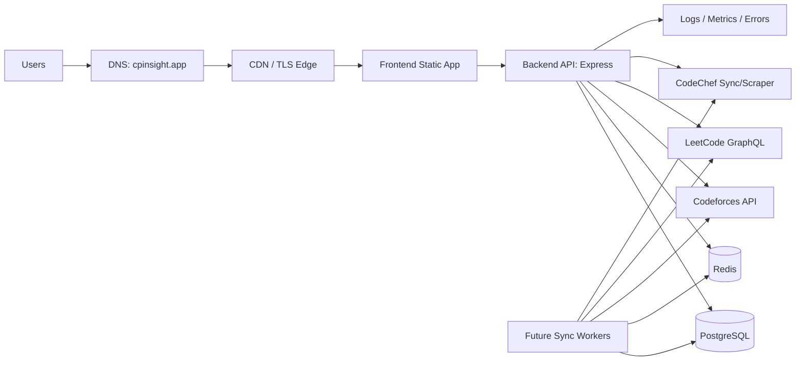

# CPInsight Deployment Strategy

CPInsight should deploy as two stateless web services plus managed state:

- Frontend: static HTML/Tailwind/JavaScript served by CDN or Nginx.
- Backend API: Node.js/Express container.
- PostgreSQL: durable relational store.
- Redis: cache, rate-limit state, sync locks.
- Background workers: future platform sync and AI jobs.

## Architecture Diagram



## Local Development Architecture

Use the root Docker Compose file for production-like local development:

- `frontend`: Nginx static site on `localhost:8080`.
- `api`: Express on `localhost:4000`.
- `postgres`: exposed on `localhost:5432`.
- `redis`: exposed on `localhost:6379`.
- `migrate`: one-shot migration container behind the `tools` profile.

Commands:

```bash
cp .env.deploy.example .env.deploy
docker compose --env-file .env.deploy up -d postgres redis
docker compose --env-file .env.deploy --profile tools run --rm migrate
docker compose --env-file .env.deploy up -d api frontend
```

For backend-only development:

```bash
cd backend
npm ci
npm run migrate
npm run dev
```

## Staging Architecture

Staging should mirror production with smaller resources:

- Separate domain: `staging.cpinsight.app`.
- Separate database and Redis instance.
- Same Docker images as production.
- Same migrations as production.
- Seed only test users and synthetic handles.
- Lower Redis memory, smaller Postgres plan.

Staging deploys automatically from `develop` or manually from GitHub Actions.

## Production Architecture

Recommended production topology:

- Static frontend on CDN-backed hosting.
- API as a containerized web service.
- Managed PostgreSQL with backups and point-in-time recovery where available.
- Managed Redis with eviction policy.
- Private networking between API, Postgres, and Redis.
- HTTPS termination at platform load balancer or reverse proxy.

For a VPS, use:

- Caddy or Traefik for HTTPS and reverse proxy.
- Docker Compose for service orchestration.
- UFW firewall: allow only `22`, `80`, `443`.
- Postgres and Redis private to Docker network.

## Docker Architecture

Root files:

- `frontend.Dockerfile`: Nginx static frontend.
- `backend/Dockerfile`: Node.js API.
- `docker-compose.yml`: local and base deployment.
- `docker-compose.prod.yml`: production overrides.
- `.env.deploy.example`: deploy env template.

Networks:

- `cpinsight-public`: frontend and API ingress.
- `cpinsight-private`: API, Postgres, Redis.

Volumes:

- `postgres-data`: durable database files.
- `redis-data`: Redis AOF persistence.

Health checks:

- Frontend: `GET /healthz`.
- API: `GET /health`.
- Postgres: `pg_isready`.
- Redis: `redis-cli ping`.

## Hosting Recommendation

| Platform | Strengths | Weaknesses | Best Use |
| --- | --- | --- | --- |
| Railway | Fastest full-stack setup, easy Postgres/Redis, simple env vars | Costs can grow, less infra control | Best student/early SaaS choice |
| Render | Good static + API + Postgres, predictable UX | Redis often external/paid, cold starts on low tiers | Strong low-ops choice |
| VPS | Cheapest at scale, full control | You own security, backups, updates, incidents | Best once traffic and budget justify ops |
| Fly.io | Great global app deployment, private networking | More complex, Postgres ops require care | Best for low-latency multi-region later |

Recommendation:

- Student project: Railway.
- Low cost and fast deployment: Railway first, Render second.
- Production with serious control: VPS with Caddy + Docker Compose.
- Future global scaling: Fly.io or Kubernetes after product-market fit.

## Deployment Workflow

1. Push to GitHub.
2. CI runs backend install, production audit, syntax tests, Docker builds.
3. Staging deploy runs migrations, then rolls API/frontend.
4. Smoke tests hit `/health`, `/ready`, and frontend `/healthz`.
5. Production deploy is promoted from a known-good commit.
6. Production migrations run before replacing API containers.
7. Old images are pruned only after health checks pass.

## CI/CD Workflow

Included workflows:

- `.github/workflows/ci.yml`
  - Installs backend dependencies.
  - Runs `npm run audit:prod`.
  - Runs `npm test`.
  - Builds backend and frontend Docker images.

- `.github/workflows/deploy-managed.yml`
  - Triggers Render or Railway deploy hooks from GitHub secrets.

- `.github/workflows/deploy-vps.yml`
  - SSH deploys to `/opt/cpinsight`.
  - Builds images.
  - Runs migrations.
  - Restarts services.

Required GitHub secrets for VPS:

- `VPS_HOST`
- `VPS_USER`
- `VPS_SSH_KEY`
- `VPS_PORT`

Required GitHub secrets for managed hosting:

- `RENDER_DEPLOY_HOOK_URL` or `RAILWAY_DEPLOY_HOOK_URL`

## Environment Variable Strategy

Never commit real secrets.

Local:

- `.env.deploy` from `.env.deploy.example`.
- `backend/.env` for backend-only development.

Staging:

- Separate `DATABASE_URL`, `REDIS_URL`, JWT secrets, and frontend origin.
- Shorter refresh-token TTL is acceptable.

Production:

- 64+ random character JWT secrets.
- Strong database password.
- `NODE_ENV=production`.
- `FRONTEND_ORIGIN=https://cpinsight.app,https://www.cpinsight.app`.
- Rotate secrets if exposed.

Generate secrets:

```bash
openssl rand -base64 64
```

## Database Deployment

Migration strategy:

- SQL migrations live in `backend/src/database/migrations`.
- Apply migrations in CI/CD before starting new API containers.
- Migrations must be backward compatible once real users exist.
- Avoid destructive changes without a two-phase deploy.

Managed Postgres recommendation:

- Railway Postgres for quick launch.
- Render Postgres for simple managed hosting.
- Supabase/Neon if you want a generous managed Postgres tier.
- VPS Postgres only if you can operate backups and upgrades.

Backups:

- Daily automated backups.
- Retain 7 daily, 4 weekly, 3 monthly snapshots.
- Test restore monthly.
- For VPS, use `ops/backup/postgres-backup.ps1` or a Linux cron equivalent with `pg_dump`.

Production config:

- Enable SSL for external DB connections.
- Keep DB private where platform supports it.
- Add indexes through migrations only.
- Monitor slow queries and connection count.

## Redis Deployment

Redis responsibilities:

- Profile cache.
- Analytics cache.
- Upstream API cache.
- Rate-limit state.
- Sync locks.

TTL strategy:

- `profile:{userId}`: 10 minutes.
- `platform-account:{userId}:{platform}`: 15 minutes.
- `analytics:{userId}:{platform}:{window}`: 30 minutes.
- `analytics:{userId}:combined:{window}`: 15 minutes.
- `upstream:codeforces:user.info:{handle}`: 10 minutes.
- `upstream:codeforces:user.status:{handle}`: 5 minutes.
- `sync-lock:{platform}:{handle}`: 10 minutes.

Memory management:

- Start with 256 MB.
- Use `allkeys-lru` for cache-heavy Redis.
- Alert at 80% memory.
- Keep Redis private.
- Use managed Redis in production when possible.

## Domain, SSL, HTTPS, DNS

Recommended domain shape:

- `cpinsight.app`: frontend.
- `www.cpinsight.app`: frontend alias.
- `api.cpinsight.app`: backend API.
- `staging.cpinsight.app`: staging frontend.
- `api-staging.cpinsight.app`: staging API.

DNS:

- For Railway/Render/Fly: create `CNAME` records to platform-provided targets.
- For VPS: create `A` records to the server public IP.

SSL:

- Railway/Render/Fly provision certificates automatically.
- VPS should use Caddy for automatic Let's Encrypt certificates.

HTTPS:

- Redirect HTTP to HTTPS.
- Set `API_BASE_URL=https://api.cpinsight.app`.
- Set production CORS allowlist to HTTPS frontend origins only.

## Security

Already implemented in backend:

- Helmet.
- CORS allowlist.
- Global, auth, and analytics rate limits.
- Joi validation.
- Parameterized SQL.
- Bcrypt password hashing.
- JWT access tokens.
- Hashed refresh tokens with rotation.

Production hardening:

- Serve only HTTPS.
- Store refresh tokens in secure, HTTP-only cookies when frontend integration is updated.
- Keep access tokens short-lived: 15 minutes.
- Rotate refresh tokens on every refresh.
- Revoke refresh token on logout.
- Do not expose Postgres/Redis publicly.
- Use platform secret managers.
- Enable dependency audits in CI.

## Observability

Logging:

- Start with platform logs plus JSON logs.
- Upgrade from Morgan to Pino for structured production logs.
- Include request ID, user ID when authenticated, route, status, latency.

Error tracking:

- Sentry for backend exceptions.
- Source maps are not relevant for current static frontend, but should be added if bundling later.

Uptime monitoring:

- Better Stack, UptimeRobot, or Checkly.
- Monitor:
  - Frontend `/healthz`
  - API `/health`
  - API `/ready`

Metrics:

- Track latency p50/p95/p99.
- Error rate by endpoint.
- Postgres connections and slow queries.
- Redis memory and evictions.
- Upstream Codeforces/LeetCode/CodeChef failure rate.

## Scaling Plan

### 1,000 Users

Architecture:

- One API instance.
- Managed Postgres small plan.
- Managed Redis 256 MB.
- Static frontend on CDN.

Bottlenecks:

- Upstream API rate limits.
- Inefficient analytics recomputation.

Fix:

- Cache aggressively.
- Persist normalized histories.
- Avoid request-time scraping.

### 10,000 Users

Architecture:

- 2 to 4 API instances behind load balancer.
- Managed Postgres with connection pooling.
- Redis 1 GB.
- Dedicated background worker.

Bottlenecks:

- Postgres connection count.
- Analytics joins over large submission tables.
- Platform sync fanout.

Fix:

- PgBouncer or platform pooler.
- Partition large histories by platform/time later.
- Queue-based sync with rate limits.
- Precompute analytics_cache.

### 100,000 Users

Architecture:

- Horizontally scaled API.
- Separate workers by platform.
- Read replicas for analytics.
- Larger Redis or Redis cluster.
- Object storage for exported reports.

Bottlenecks:

- Submission history volume.
- Combined analytics cost.
- Upstream API/scraping reliability.
- Database write pressure from sync jobs.

Fix:

- Event-driven sync pipeline.
- Materialized analytics tables.
- Partition `submission_history`.
- Dedicated queues per platform.
- Backpressure and priority scheduling.
- Move AI workloads to async jobs.

## Production Deployment Checklist

- [ ] Domain purchased.
- [ ] DNS records configured.
- [ ] HTTPS active.
- [ ] Production env vars set.
- [ ] Strong JWT secrets generated.
- [ ] Postgres provisioned and private.
- [ ] Redis provisioned and private.
- [ ] Migrations applied.
- [ ] CI passing.
- [ ] Dependency audit clean.
- [ ] Backups enabled and restore tested.
- [ ] Uptime checks configured.
- [ ] Error tracking configured.
- [ ] CORS restricted to production domains.
- [ ] Rate limits reviewed.
- [ ] Logs visible and searchable.

## Step-by-Step Railway Deployment

1. Push repo to GitHub.
2. Create Railway project from GitHub repo.
3. Add PostgreSQL service.
4. Add Redis service.
5. Add backend service from `backend/Dockerfile`.
6. Add frontend static/container service from `frontend.Dockerfile`.
7. Set backend env vars from `.env.deploy.example`.
8. Set `DATABASE_URL` and `REDIS_URL` from Railway service variables.
9. Run migration command once:

```bash
node src/database/migrate.js
```

10. Add domains:
    - frontend: `cpinsight.app`
    - backend: `api.cpinsight.app`
11. Update `FRONTEND_ORIGIN` and `API_BASE_URL`.
12. Trigger deploy and verify `/health`, `/ready`, and frontend load.

## Step-by-Step VPS Deployment

1. Provision Ubuntu VPS.
2. Install Docker and Docker Compose.
3. Clone repo:

```bash
git clone <repo-url> /opt/cpinsight
cd /opt/cpinsight
cp .env.deploy.example .env.deploy
```

4. Fill production secrets in `.env.deploy`.
5. Start services:

```bash
docker compose --env-file .env.deploy -f docker-compose.yml -f docker-compose.prod.yml up -d postgres redis
docker compose --env-file .env.deploy -f docker-compose.yml -f docker-compose.prod.yml --profile tools run --rm migrate
docker compose --env-file .env.deploy -f docker-compose.yml -f docker-compose.prod.yml up -d frontend api
```

6. Add Caddy for HTTPS:

```caddyfile
cpinsight.app, www.cpinsight.app {
  reverse_proxy localhost:80
}

api.cpinsight.app {
  reverse_proxy localhost:4000
}
```

7. Configure GitHub Actions VPS secrets.
8. Run the deploy workflow.
