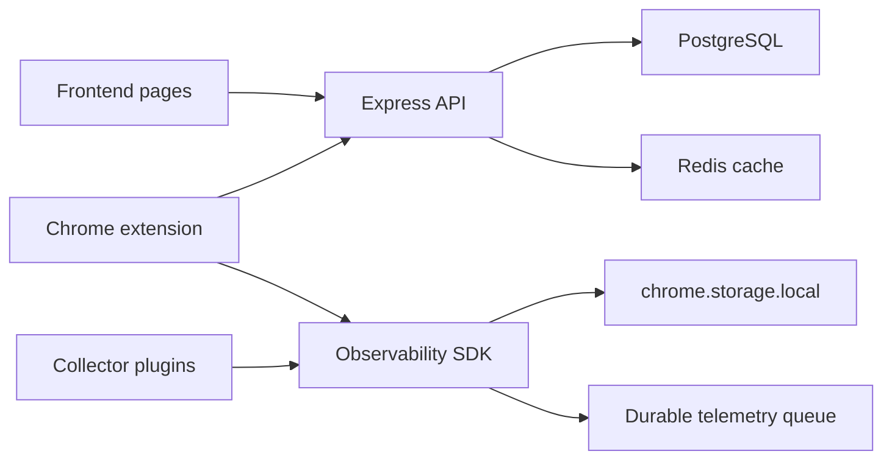

# CPInsight Engineering Documentation

CPInsight is a competitive programming analytics system. It combines a web frontend, an Express backend, PostgreSQL, Redis, and a Chrome extension. The current system supports account management, platform account synchronization, analytics views, LeetCode extension uploads, and a platform-agnostic Observability SDK for contest-session telemetry detection on Codeforces and CodeChef.

This directory is the architectural source of truth for the repository. It explains what exists, why it is shaped this way, and how future contributors should extend it without breaking the current boundaries.

## Primary Goals

- Provide one account-level view of competitive programming activity across supported platforms.
- Keep platform integrations isolated from analytics and storage internals.
- Use durable persistence for user, platform, analytics, authentication, and extension upload state.
- Establish a generic observability foundation that can later support browser, desktop, editor, and mobile clients.
- Preserve clear dependency direction: UI calls backend APIs; backend owns database writes; extension collectors emit standardized SDK events; collectors do not perform analytics or backend work.

## System Capabilities

Implemented:

- User registration, login, refresh-token rotation, logout.
- User profile and avatar management.
- Platform account connection and synchronization for Codeforces, CodeChef, LeetCode, and AtCoder in the database enum and validation layer.
- Analytics endpoints for Codeforces, CodeChef, LeetCode, and combined views.
- LeetCode authenticated extension upload endpoint.
- Manifest V3 Chrome extension with background service worker, content scripts, provider messaging, local storage, and observability content bridge.
- Platform-agnostic Observability SDK with collector registry, event bus, event pipeline, schema validation, session engine, lifecycle FSM, persistence, and queued transport.
- Reliable telemetry upload from the Observability SDK queue to the authenticated backend ingestion API.
- Codeforces and CodeChef contest-session collector plugins.

Planned:

- Realtime telemetry transport.
- Live dashboards.
- RAG and AI mentor features.

## Technology Stack

| Area | Implementation |
| --- | --- |
| Frontend | Static HTML, CSS, browser JavaScript under `pages/`, `css/`, and `script/` |
| Backend | Node.js, Express, Joi validation, JWT, bcrypt |
| Database | PostgreSQL 16, SQL migrations, JSONB metadata |
| Cache | Redis 7 with append-only persistence and LRU memory policy in Docker |
| Extension | Chrome Manifest V3, ES modules, service worker, content scripts, Chrome storage |
| Extension tests | Node runtime verification harness |
| Deployment | Docker Compose, Nginx config, backend migration command |

## Repository Layout

```text
CP-INSIGHT/
  backend/       Express API, services, repositories, migrations
  css/           Frontend styles
  docs/          Engineering documentation
  extension/     Chrome extension and Observability SDK
  ops/           Nginx, PostgreSQL init, backup scripts
  pages/         Static frontend pages
  script/        Frontend browser JavaScript
```

## Quick Architecture



## Documentation Index

Repository operations:

- [Operations Handbook](OPERATIONS.md)
- [Testing Strategy](TESTING.md)
- [Security Engineering](SECURITY.md)
- [Contributing Guide](CONTRIBUTING.md)
- [Changelog](CHANGELOG.md)
- [Glossary](GLOSSARY.md)

Architecture:

- [System Overview](architecture/system-overview.md)
- [Frontend](architecture/frontend.md)
- [Backend](architecture/backend.md)
- [Observability SDK](architecture/observability-sdk.md)
- [Chrome Extension](architecture/chrome-extension.md)
- [Database](architecture/database.md)
- [Authentication](architecture/authentication.md)
- [Telemetry](architecture/telemetry.md)
- [RAG Roadmap](architecture/rag-roadmap.md)
- [Future Roadmap](architecture/future-roadmap.md)
- [Deployment](architecture/deployment.md)

API:

- [API Reference](api/README.md)
- [Authentication API](api/authentication-api.md)
- [Analytics API](api/analytics-api.md)
- [Telemetry and Extension API](api/telemetry-api.md)

Database:

- [Schema](database/schema.md)
- [Migrations](database/migrations.md)

Sequences:

- [User Login](sequence/authentication-flow.md)
- [Extension Authentication](sequence/extension-authentication.md)
- [Contest Session](sequence/contest-session.md)
- [Telemetry Flow](sequence/telemetry-flow.md)
- [Extension Upload](sequence/extension-upload.md)
- [Analytics Refresh](sequence/analytics-refresh.md)
- [Future Live Telemetry](sequence/future-live-telemetry.md)

Architecture Decision Records:

- [ADR-0001 Platform-Agnostic Observability SDK](decisions/ADR-0001-platform-agnostic-observability-sdk.md)
- [ADR-0002 Plugin Collector Architecture](decisions/ADR-0002-plugin-collector-architecture.md)
- [ADR-0003 Session Engine](decisions/ADR-0003-session-engine.md)
- [ADR-0004 Lifecycle State Machine](decisions/ADR-0004-lifecycle-state-machine.md)
- [ADR-0005 Generic Event Schema](decisions/ADR-0005-generic-event-schema.md)
- [ADR-0006 Event Pipeline](decisions/ADR-0006-event-pipeline.md)
- [ADR-0007 Persistence Layer](decisions/ADR-0007-persistence-layer.md)
- [ADR-0008 Transport Abstraction](decisions/ADR-0008-transport-abstraction.md)
- [ADR-0009 Collector Contract](decisions/ADR-0009-collector-contract.md)
- [ADR-0010 UUID Event Identity](decisions/ADR-0010-uuid-event-identity.md)
- [ADR-0011 Chrome Extension Architecture](decisions/ADR-0011-chrome-extension-architecture.md)
- [ADR-0012 Repository Architecture](decisions/ADR-0012-repository-architecture.md)
- [ADR-0013 Telemetry Processing Pipeline](decisions/ADR-0013-telemetry-processing-pipeline.md)

Existing operational document:

- [Deployment Notes](DEPLOYMENT.md)
