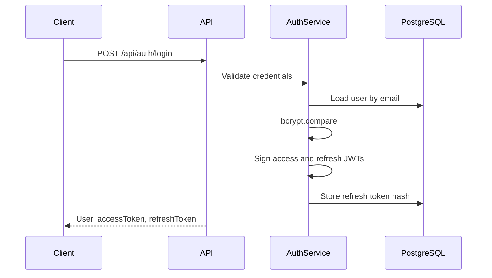

# Authentication Architecture

CPInsight uses JWT access tokens and rotating refresh tokens.

## Token Types

| Token | Purpose | Storage |
| --- | --- | --- |
| Access token | Authenticates API requests | Client-side runtime state |
| Refresh token | Issues new access token | Client-side runtime state, hash stored in PostgreSQL |

Access tokens are signed with `JWT_ACCESS_SECRET`. Refresh tokens are signed with `JWT_REFRESH_SECRET` and include a refresh-token family id.

## Flow

## Refresh Rotation

On refresh:

1. Backend verifies the refresh JWT.
2. Backend hashes the presented refresh token.
3. Backend finds an active matching token row.
4. Backend issues a new access token and refresh token in the same family.
5. Backend revokes the previous refresh token and links it to the replacement token.

## Extension Authentication

The extension uses authenticated backend endpoints with bearer tokens. The LeetCode upload endpoint requires `authenticate` middleware. Observability SDK local events do not currently call backend telemetry endpoints.

## Threat Model

Mitigations implemented:

- Passwords are stored as bcrypt hashes.
- Refresh tokens are stored as SHA-256 hashes.
- Access tokens require issuer `cpinsight-api`.
- Refresh-token rotation reduces replay window.
- Protected routes load the user from PostgreSQL on each request.
- Authentication endpoints use rate limiting.

Risks to monitor:

- Client-side token storage must be protected from XSS in frontend surfaces.
- Refresh-token reuse detection is limited to revoked-token lookup; family-wide compromise handling can be expanded later.
- Extension message bridges must continue validating source, target, provider, session id, nonce, and correlation id.
