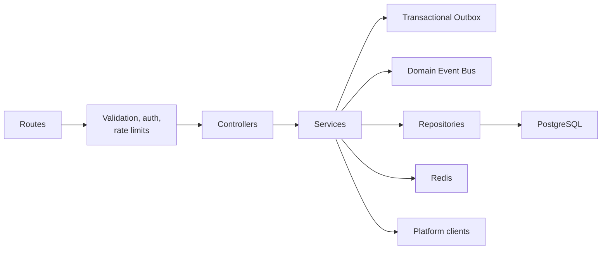

# Backend Architecture

The backend is an Express application under `backend/src`. It follows a route-controller-service-repository structure.

## Layering

The [Domain Event Bus](domain-event-bus.md) is the internal event-driven boundary for facts that downstream systems may consume. Telemetry is the first publisher; future authentication, profile, notification, recommendation, and AI subsystems should publish events through the same contract.

The [Transactional Outbox](transactional-outbox.md) is the reliability boundary between request-time database writes and post-commit domain event dispatch.

[Redis Event Distribution](redis-event-distribution.md) is the transport boundary for cross-process consumers. The backend publishes to Redis through the Domain Event Bus; consumers use Redis Streams and Consumer Groups.

[WebSocket Gateway](websocket-gateway.md) consumes Redis Streams and delivers authorized realtime messages to authenticated clients.

[Behavior Intelligence](behavior-intelligence.md) reconstructs telemetry sessions and persists behavior features and profiles for future analytics, recommendations, and AI systems.

[Behavior Knowledge](behavior-knowledge.md) consumes behavior features and persists semantic insights, graph nodes, graph edges, evidence rows, recurring patterns, and inference metrics. Its rule execution model is documented in [Insight Engine](insight-engine.md).

[Retrieval Planner](retrieval-planner.md) classifies natural-language questions and produces retrieval plans for future AI systems. It does not retrieve data, build prompts, or call LLMs. Intent classification is documented in [Intent Classification](intent-classification.md).

[Hybrid Retrieval](hybrid-retrieval.md) executes retrieval plans through source adapters and emits immutable Evidence Packages. Evidence normalization, ranking, and contradiction handling are documented in [Evidence Fusion](evidence-fusion.md).

## Module Responsibilities

| Layer | Location | Responsibility |
| --- | --- | --- |
| Routes | `backend/src/routes` | Bind HTTP method/path to middleware and controller |
| Middleware | `backend/src/middleware` | Authentication, Joi validation, rate limits, error handling |
| Controllers | `backend/src/controllers` | Convert HTTP request/response to service calls |
| Services | `backend/src/services` | Business logic and orchestration |
| Repositories | `backend/src/repositories` | SQL access and persistence operations |
| Database | `backend/src/database` | Pool and migration runner |
| Redis | `backend/src/redis` | Cache read/write helpers |

## Implemented Domains

### Authentication

`authService` handles registration, login, refresh-token rotation, and logout. It hashes passwords with bcrypt and issues JWT access and refresh tokens. Refresh tokens are persisted by hash in PostgreSQL.

### User Profile

`userService` and `userRepository` manage profile fields, college search, and avatar metadata. Avatar files are served under `/uploads`.

### Platform Accounts

`platformService` connects and synchronizes platform accounts. Platform-specific clients live under `backend/src/services/platforms`.

### Analytics

`analyticsService` computes platform and combined analytics from persisted facts. Redis and PostgreSQL cache are used for some analytics paths. LeetCode is treated more conservatively because extension-verified data may change local facts.

### Extension Uploads

`extensionUploadService` validates authenticated LeetCode extension payloads, verifies collector version and account ownership, persists upload records, replaces LeetCode submission facts, and invalidates analytics cache.

### Telemetry Ingestion

`telemetryService` accepts authenticated Observability SDK upload batches and delegates telemetry semantics to the processing pipeline. The pipeline validates schema version, timestamp sanity, ordering, and idempotency; enriches and classifies events; stores raw events and processed metadata; records metrics; and returns acknowledged event ids. It does not compute analytics.

## Error Handling

Controllers are wrapped with `asyncHandler`. Domain errors use `HttpError`. The global error handler serializes errors into HTTP responses. Validation uses Joi schemas and rejects invalid request shapes before service execution.

## Background Jobs

`backend/src/jobs/syncPlatformsJob.js` exists for platform synchronization work. The current architecture keeps jobs in the backend because they operate on persisted platform accounts and database facts.

## Security Boundaries

- Authentication middleware verifies bearer JWTs and loads the user from PostgreSQL.
- Password hashes are never returned.
- Refresh tokens are stored as SHA-256 hashes.
- Extension upload endpoints require the same bearer authentication model as the frontend.

See [Authentication](authentication.md) for token flow and threat model.
