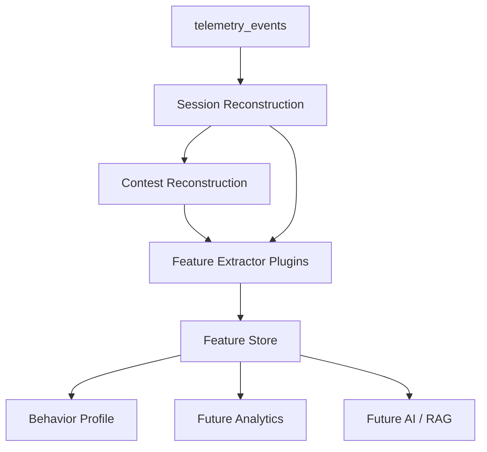

# Behavior Intelligence Engine

The Behavior Intelligence Engine converts low-level telemetry into reusable behavioral features. It does not perform AI generation, recommendations, coaching, embeddings, or dashboard rendering.

## Architecture

## Session Reconstruction

The reconstructor groups accepted telemetry events by `session_id`, deduplicates by `event_id`, and sorts by event timestamp and sequence number.

Each reconstructed session contains:

- Start and end timestamps.
- Duration.
- Platform.
- Contest id.
- Session type: `contest` or `practice`.
- Session status: `completed`, `interrupted`, `abandoned`, or `active`.
- Problem timeline.
- Focus timeline.
- Submission timeline.
- Navigation timeline.

## Contest Reconstruction

Contest reconstruction derives:

- Opening, middle, and late phases.
- Problem sequence.
- Time allocation by problem.
- Navigation history.
- Submission chronology.
- Attention shifts.
- Idle periods.
- Recovery periods.
- Pressure periods.

## Behavior Profile

Profiles aggregate extracted features into reusable behavioral dimensions:

- Reading Style.
- Decision Style.
- Attention Pattern.
- Contest Strategy.
- Persistence.
- Risk Profile.
- Stress Profile.
- Learning Style.
- Time Management.

Profiles are versioned and persisted separately from individual feature rows.

## Longitudinal Analysis

The feature store records immutable feature rows with `window_key`, `platform`, `contest_id`, source session, version, confidence, and timestamp. This supports daily, weekly, monthly, contest, platform, season, and career views without recomputing from telemetry every time.

## Confidence Model

Every feature includes confidence in `[0, 1]`. Confidence is based on telemetry density and extractor-specific evidence. Future recommendation and AI systems should ignore low-confidence features unless explicitly configured otherwise.

## Failure Handling

The engine tolerates:

- Missing telemetry.
- Incomplete sessions.
- Browser crashes.
- Duplicate events.
- Out-of-order events.
- Partial contests.

Failed extraction runs are recorded in `feature_extraction_metrics`.
