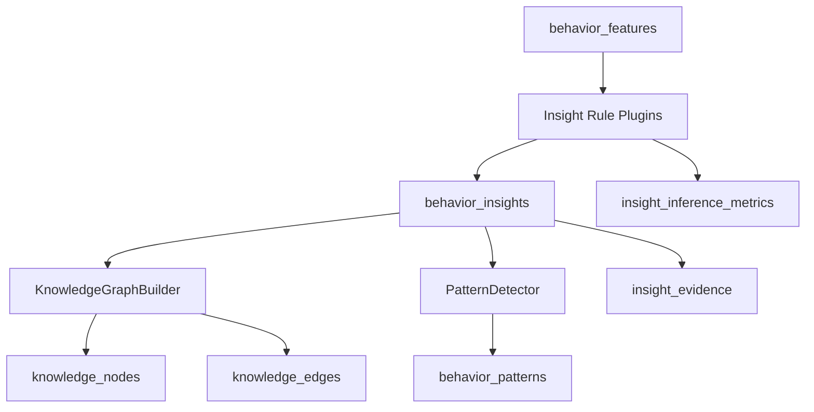

# Behavior Knowledge Layer

The Behavior Knowledge Layer converts numeric behavior features into machine-readable behavioral knowledge. It does not generate natural language, call an LLM, create embeddings, perform semantic search, or issue recommendations.

It sits after the [Behavior Intelligence Engine](behavior-intelligence.md), which reconstructs sessions and extracts features. Features are observations. Knowledge nodes, edges, insights, and patterns represent relationships inferred from those observations.

## Architecture

## Knowledge Model

The graph is persisted as versioned nodes and edges.

| Entity | Storage | Purpose |
| --- | --- | --- |
| User | `knowledge_nodes` | Root node for user-specific knowledge |
| Behavior Feature | `insight_evidence` references `behavior_features` | Evidence behind an insight |
| Behavior Pattern | `knowledge_nodes`, `behavior_patterns` | Recurring behavior such as late panic or difficulty avoidance |
| Strength | `knowledge_nodes`, `behavior_insights` | Positive inferred capability |
| Weakness | `knowledge_nodes`, `behavior_insights` | Evidence-backed limitation |
| Attention Pattern | `knowledge_nodes` | Focus and time-management inference target |
| Learning Pattern | Future node type | Reserved for future non-generative learning analysis |

Edges currently connect the user node to inferred targets with relationship types such as `HAS_STRENGTH`, `HAS_WEAKNESS`, and `HAS_PATTERN`.

## Persistence

Migration `010_behavior_knowledge_graph.sql` adds:

- `insight_versions`
- `knowledge_nodes`
- `knowledge_edges`
- `behavior_insights`
- `behavior_patterns`
- `insight_evidence`
- `insight_inference_metrics`

Insights store supporting feature IDs, evidence session IDs, confidence, time window, rule metadata, and immutable properties. Knowledge graph rows are versioned so future rule revisions can coexist with previous inference output.

## Internal API

All endpoints are authenticated and mounted under `/api/knowledge`.

| Method | Path | Purpose |
| --- | --- | --- |
| `POST` | `/infer` | Run rule inference from existing behavior features |
| `GET` | `/graph` | Return persisted nodes and edges |
| `GET` | `/strengths` | Return strength insights |
| `GET` | `/weaknesses` | Return weakness insights |
| `GET` | `/patterns` | Return recurring behavior patterns |
| `GET` | `/evolution` | Return historical insights across categories |
| `GET` | `/insights/:insightId/evidence` | Return evidence rows for one insight |

## Guarantees

- Rule execution is modular and registration-based.
- The original behavior feature payload is not mutated.
- Each insight includes confidence, supporting features, evidence sessions, a time window, and version.
- Graph nodes are upserted by `(user_id, node_type, node_key, version)`.
- Failed inference runs are recorded in `insight_inference_metrics`.

## Boundaries

This layer intentionally excludes:

- LLM calls.
- Embeddings.
- Vector databases.
- Natural language generation.
- Recommendation generation.
- RAG retrieval.

Those systems should consume knowledge rows later instead of reinterpreting raw telemetry or feature rows directly.

