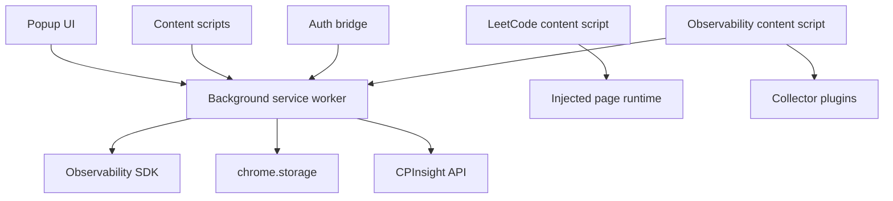

# Chrome Extension Architecture

The CPInsight extension is a Chrome Manifest V3 extension under `extension/`. It contains legacy LeetCode authenticated collection code and the newer Observability SDK contest-session detection foundation.

## Manifest

`extension/manifest.json` declares:

- Manifest version 3.
- Background service worker: `background/service-worker.js`.
- Permissions: `alarms`, `storage`, `tabs`.
- Host permissions for LeetCode, Codeforces, CodeChef, CPInsight API, and local API.
- Content scripts for:
  - Codeforces and CodeChef observability.
  - LeetCode provider collection.
  - CPInsight web auth bridge.

## Runtime Components

## Background Service Worker

The background service worker is the central coordinator. It:

- Initializes provider sync components.
- Initializes the Observability SDK.
- Registers message handlers through `MessageBus`.
- Handles alarms and tab lifecycle events.
- Sends authenticated collection requests to content scripts.
- Recovers active observability sessions on startup.

Manifest V3 service workers are not long-lived. Durable state must be written to Chrome storage instead of relying on process memory.

## Content Scripts

### Observability Content

`content/observability-bootstrap.js` dynamically imports `content/observability-content.js`. The content module:

- Registers Codeforces and CodeChef collectors.
- Detects page lifecycle events.
- Calls collector `supports()` and `collect()`.
- Sends generic snapshots to the background worker.
- Calls collector `pause()`, `resume()`, and `destroy()` during page lifecycle events.

### LeetCode Content

`content/content-script.js` loads `content/main.js`, which coordinates with the injected page runtime and the existing LeetCode provider. This path is separate from the Observability SDK.

### Auth Bridge

`content/auth-bridge.js` supports interaction between CPInsight web pages and the extension.

## Messaging

Messages use envelopes from `messaging/envelope.js`. The background registers handlers in `MessageBus`.

Important observability message types:

- `observability:page:snapshot`
- `observability:page:exit`

Important provider message types:

- `provider:collect:request`
- `provider:collect:result`
- `network:event`
- `page:state:changed`

## Storage

Chrome storage is used for:

- Extension state.
- Provider checkpoints.
- LeetCode collection session and upload state.
- Observability sessions, event log, queue, tab index, and metadata.

Collectors never write storage directly.

## Permissions and Security

The extension only requests host permissions required by current collectors, LeetCode collection, and backend API communication. It does not read cookies, passwords, clipboard data, or arbitrary browser history. Content scripts run only on declared host patterns.

## Future Collector Integration

Adding a new Observability SDK platform requires:

1. Create a collector implementing the common contract.
2. Register it in `extension/observability/platforms/index.js`.
3. Add host permissions and content script match patterns in the manifest.

The SDK lifecycle, event schema, persistence, and transport should not change for a new collector.
