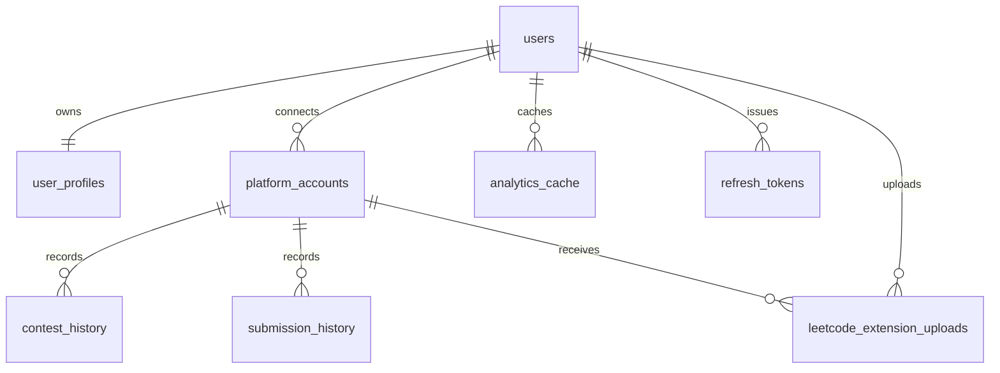

# Database Architecture

CPInsight uses PostgreSQL as the durable system of record. Redis is used as a cache, not as canonical storage.

## PostgreSQL Responsibilities

- User accounts and profiles.
- Platform account connections.
- Contest history.
- Submission history.
- Analytics cache.
- Refresh token hashes.
- LeetCode extension upload idempotency records.

## Entity Overview

## Normalization

The schema separates user identity, profile details, platform accounts, contests, and submissions. Platform-specific data that does not require relational querying is stored in JSONB metadata columns. This preserves normalized core facts while allowing platform clients to store extra data without immediate migrations.

## Indexing Strategy

Indexes support:

- Case-insensitive uniqueness for username and email.
- Fast platform account lookup by user.
- Contest and submission lookup by account and time.
- Submission lookup by platform and problem key.
- GIN tag search.
- Analytics cache expiry checks.
- Active refresh-token lookup.
- LeetCode upload lookup by session id.

## Redis Role

Redis stores computed analytics responses and profile/analytics cache keys. It is safe to invalidate Redis because PostgreSQL remains canonical.

## Extension Observability Storage

Observability SDK state currently lives in Chrome local storage, not PostgreSQL. Backend telemetry persistence has not been implemented. See [Telemetry](telemetry.md).

Detailed table documentation is in [Database Schema](../database/schema.md).
