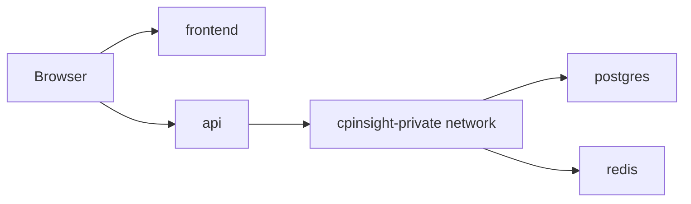

# Deployment Architecture

CPInsight includes Docker Compose definitions for local or server deployment.

## Services

| Service | Source | Purpose |
| --- | --- | --- |
| `frontend` | `frontend.Dockerfile` | Serves static frontend through Nginx |
| `api` | `backend/Dockerfile` | Runs Express API |
| `migrate` | `backend/Dockerfile` | Runs SQL migrations |
| `postgres` | `postgres:16-alpine` | Durable relational database |
| `redis` | `redis:7-alpine` | Analytics cache |

## Network Model

The private Docker network isolates PostgreSQL and Redis from public frontend traffic. The API connects to both public and private networks.

## Configuration

The API reads environment from `.env.deploy` by default through Docker Compose. Required variables include:

- `DATABASE_URL`
- `REDIS_URL`
- `JWT_ACCESS_SECRET`
- `JWT_REFRESH_SECRET`
- `POSTGRES_PASSWORD`

`.env.deploy` is intentionally ignored by Git.

## Migration Flow

Run the `migrate` profile to execute `backend/src/database/migrate.js`. Migrations are ordered SQL files under `backend/src/database/migrations`.

See also the existing [Deployment Notes](../DEPLOYMENT.md).
