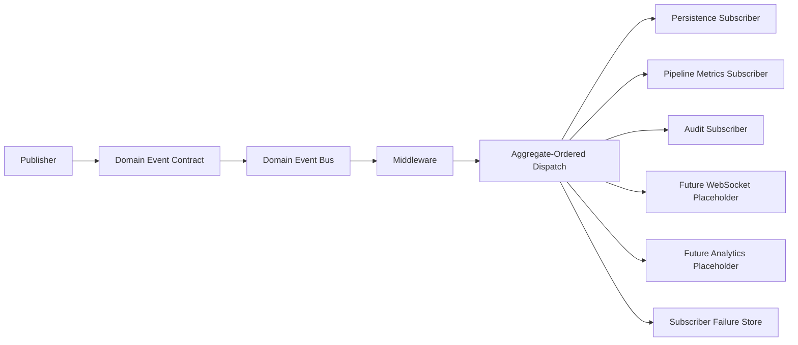
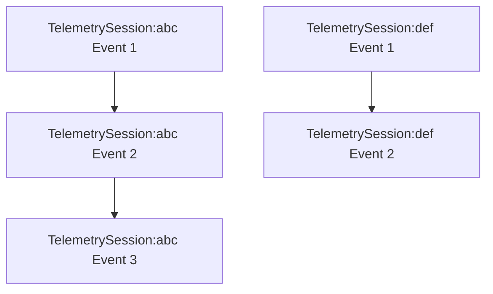
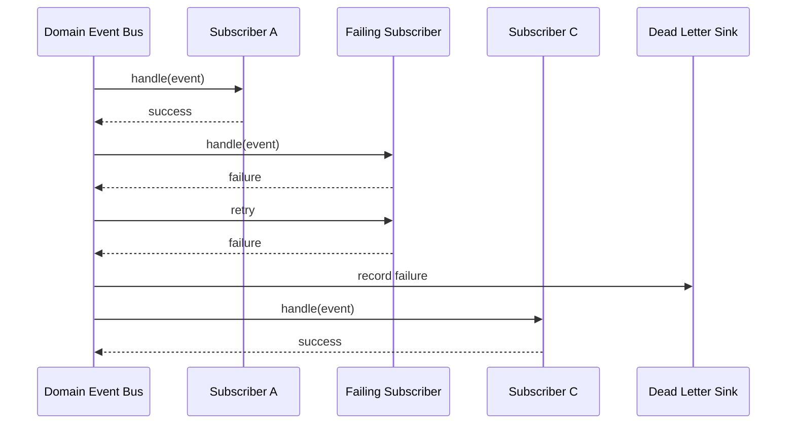
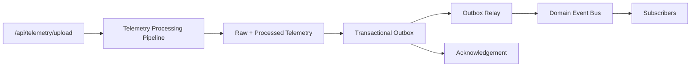

# Domain Event Bus

The Domain Event Bus is the backend communication layer for business facts produced inside CPInsight. It is generic: telemetry is one publisher, not the owner of the bus. Request-time publishers write domain events to the [Transactional Outbox](transactional-outbox.md); the relay publishes committed events to the bus.

## Purpose

The bus prevents downstream systems from coupling directly to telemetry ingestion or any future producer. Publishers emit immutable domain events. Subscribers independently react to those events.

Future backend capabilities such as analytics refresh, WebSocket fan-out, notifications, recommendations, AI enrichment, and replay should subscribe to domain events instead of calling telemetry services directly.

## Architecture



Implemented publisher:

- Transactional Outbox Relay Worker.

Implemented subscribers:

- `domain-event-persistence`: stores immutable domain events in `domain_events`.
- `domain-event-metrics`: records dispatch metrics.
- `domain-event-audit`: records audit observations.
- `future-websocket-gateway`: registered placeholder with no event subscriptions.
- `future-analytics`: registered placeholder with no event subscriptions.

## Event Contract

Every event follows the same immutable schema:

```json
{
  "eventId": "uuid",
  "eventType": "ProblemOpened",
  "eventVersion": 1,
  "occurredAt": "2026-07-23T12:00:00.000Z",
  "publishedAt": "2026-07-23T12:00:00.050Z",
  "aggregateType": "TelemetrySession",
  "aggregateId": "contest_session_123",
  "source": "telemetry.pipeline",
  "payload": {},
  "metadata": {},
  "correlationId": "uuid",
  "causationId": "uuid"
}
```

Contract rules:

- `eventId` is globally unique.
- `eventType` is domain-level and versioned by `eventVersion`.
- `payload` carries event-specific data.
- `metadata` carries operational context such as request id, batch id, schema version, SDK version, and collector version.
- `correlationId` links events produced by the same request.
- `causationId` links a domain event to the event that caused it.

## Middleware

Middleware runs before subscribers.

Implemented middleware:

| Middleware | Responsibility |
| --- | --- |
| Validation | Enforces the domain event contract. |
| Tracing | Adds correlation and causation context to dispatch context. |
| Logging | Emits structured internal diagnostics when a logger is configured. |

Middleware may reject invalid events, return a transformed event, pass the event through, or drop it by returning `null`.

## Ordering

The bus guarantees serial dispatch for events with the same `(aggregateType, aggregateId)` pair.



Different aggregates may dispatch independently. This preserves session-level ordering without forcing unrelated users or sessions through a single global lock.

## Failure Isolation

Subscriber failures do not stop propagation to later subscribers.



Each subscriber declares its retry policy. When retries are exhausted, the bus records structured failure details in `domain_event_subscriber_failures` and continues dispatch.

## Telemetry Integration

The telemetry pipeline persists outbox events after raw and processed telemetry persistence. The relay publishes them after commit.



The telemetry pipeline does not know subscriber implementations. It receives an outbox repository through dependency injection.

## Backpressure Model

Current dispatch is in-process and promise-based. The bus tracks queue depth, serializes per aggregate, and rejects publication when the configurable queue-depth limit is exceeded. This is sufficient for the current single-backend deployment path and keeps Phase 2.3 lightweight.

Future horizontal scaling should add a durable external broker or outbox relay while preserving the same event contract and subscriber interface.

## Runtime Verification

The runtime verification harness is:

```bash
cd backend
node scripts/verify-domain-event-bus.js
```

It verifies multiple subscribers, subscriber failure isolation, retries, ordering, concurrency, large bursts, middleware execution, late subscriber registration, and duplicate subscription rejection.
