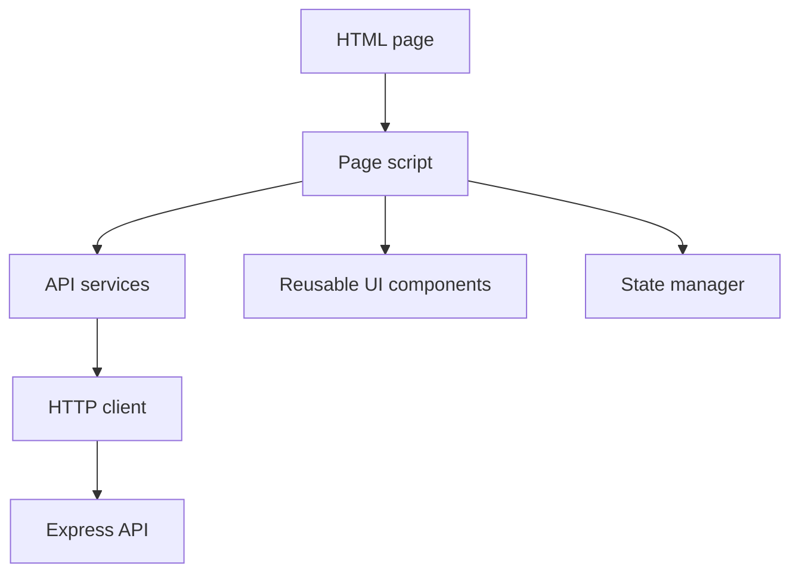

# Frontend Architecture

The frontend is a static browser application. It is organized as HTML pages under `pages/`, shared styles under `css/`, and page-specific or shared JavaScript under `script/`.

## Responsibilities

- Present authentication, dashboard, analytics, calendar, comparison, profile, roadmap, and platform account views.
- Call backend APIs through shared JavaScript services.
- Store client auth state in browser-side state management utilities.
- Render analytics payloads from the backend.

The frontend does not compute durable analytics. It is a presentation layer over backend API responses.

## Structure

```text
pages/
  auth.html
  dashboard.html
  analytics.html
  calendar.html
  compare.html
  landing_page.html
  platforms.html
  profile.html
  roadmap.html
script/
  services/
  components/
  utils/
css/
  shared.css
  landing_page.css
src/components/ai/
  tokens/
  theme/
  base/
  cards/
  reasoning/
  timeline/
  feedback/
  layout/
src/features/ai-coach/
  api/
  components/
  hooks/
  state/
  styles/
```

The React AI Design System is isolated under `src/components/ai`. It is available for future AI surfaces without requiring existing static pages to migrate immediately. See [AI Design System](../frontend/ai-design-system.md).

The AI Coach Workspace is isolated under `src/features/ai-coach`. It consumes existing backend AI APIs and uses the AI Design System throughout. See [AI Coach Workspace](../frontend/ai-coach-workspace.md).

## Component Model



## API Interaction

Frontend services call backend endpoints documented in [API Reference](../api/README.md). Authentication-protected routes require a bearer access token. Token refresh is part of the authentication service flow documented in [Authentication](authentication.md).

## Design Constraints

- The frontend should not directly query PostgreSQL or Redis.
- The frontend should not contain platform scraping logic.
- Platform data displayed in analytics views should come from backend analytics responses.
- Extension telemetry and content-script behavior belong in `extension/`, not frontend pages.

## Future Direction

If the broader frontend is migrated to a component framework, the architectural boundary should remain the same: UI components call service modules, service modules call the backend, and domain persistence remains server-side. The AI Design System already follows this boundary: it is presentational and does not call backend APIs. The AI Coach Workspace follows the application-side boundary: it calls backend APIs through an adapter but does not implement AI reasoning, retrieval, or validation locally.
