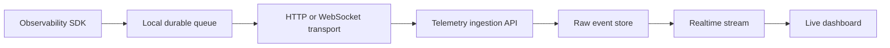

# Future Architecture Roadmap

This document describes planned architecture only. It does not describe implemented behavior unless a section explicitly says it is implemented.

## Implemented Foundations

- Backend account, platform, analytics, authentication, and LeetCode extension upload APIs.
- PostgreSQL fact storage and Redis analytics cache.
- Chrome extension runtime.
- Platform-agnostic Observability SDK with durable local session/event queue.
- Codeforces and CodeChef contest-session detection collectors.

## Realtime Telemetry

Planned direction:

Realtime telemetry should preserve durable raw events before deriving metrics. Live views should subscribe to derived projections, not mutate raw event history.

## WebSockets

WebSockets are appropriate for live contest dashboards and low-latency session updates. They should be added as a transport implementation, not as collector code.

Required design work:

- Authentication for socket connections.
- Queue replay when the socket reconnects.
- Backpressure and batch sizing.
- Server-side idempotency by event id.

## Live Dashboard

The live dashboard should read server-side projections of telemetry events. It should not directly trust client-reported derived metrics. Session state should be reconstructed from validated events.

## RAG

RAG should consume normalized facts, not raw scraped pages. Candidate sources:

- Submission history.
- Contest history.
- Topic strength.
- Future telemetry session summaries.
- User-authored notes if added later.

See [RAG Roadmap](rag-roadmap.md).

## AI Mentor

The AI mentor should be implemented as a backend service after retrieval, evaluation, and consent boundaries exist. It should not run inside extension collectors.

## Recommendation Engine

Recommendations should begin as deterministic backend services using tags, difficulty, solved history, and rating progression. AI-generated recommendations can be layered later once baseline quality metrics exist.

## Future Platforms

Future platform onboarding should follow this path:

1. Add platform account support in backend validation and platform clients if account analytics are needed.
2. Add an Observability SDK collector if contest-session telemetry is needed.
3. Add manifest host permissions for browser collectors.
4. Add backend ingestion mappings only after telemetry API exists.

The Observability SDK core should not be modified for a new platform unless the generic collector contract itself is insufficient.

## Future Desktop and Mobile Clients

Desktop and mobile clients should act as SDK hosts or event producers. They should use the same event schema and transport contracts as the extension. They should not introduce separate telemetry schemas.
