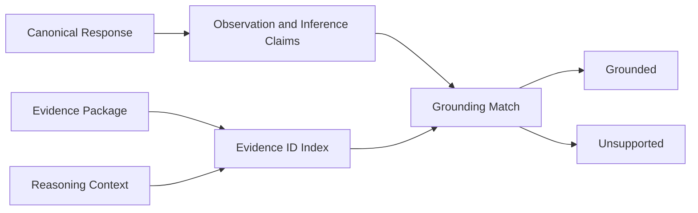

# Grounding Engine

The Grounding Engine verifies that AI response claims are supported by deterministic evidence. It protects the AI Coach boundary by rejecting observations, citations, and recommendations that cannot be traced back to an [Evidence Package](hybrid-retrieval.md), [Behavior Knowledge](behavior-knowledge.md), or [Reasoning Context](reasoning-context-engine.md).

## Evidence Boundary

The validator accepts only evidence identifiers already produced by upstream deterministic systems:

- Evidence Package records.
- Reasoning Context evidence summaries.
- Behavior findings and causal chains.
- Knowledge graph and behavior profile references included in the package.

The grounding layer does not retrieve new evidence and does not infer new behavioral facts.

## Flow

## Grounding Rules

- Every observation must cite at least one valid evidence identifier.
- Every inference must be supported by evidence or by a reasoning finding that already contains evidence.
- Evidence confidence contributes to grounding coverage.
- Unsupported claims remain visible in the validation report instead of being silently accepted.
- Fabricated evidence identifiers are treated as validation failures.

## Citation Validation

The citation validator checks that response citations reference known evidence identifiers. It rejects invented citations and reports the missing identifiers. Citation validation is separate from grounding because a response can cite valid evidence while still making an unsupported claim.

## Recommendation Validation

Recommendations are accepted only when they contain evidence identifiers that exist in the package or context. The validator calculates a support rate and rejects recommendations below the configured support threshold.

## Confidence Alignment

The confidence validator compares model-provided confidence against deterministic confidence from:

- Evidence Package confidence summary.
- Reasoning Context confidence.
- Grounding coverage.
- Citation quality.
- Recommendation support.

Model confidence is clamped into a valid range and cannot exceed deterministic support by an arbitrary amount.
