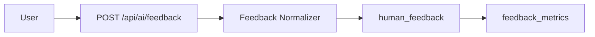

# Human Feedback

The Human Feedback subsystem records user feedback about validated AI responses. Feedback is asynchronous and does not mutate evidence, reasoning contexts, or behavior knowledge.

## Feedback Types

Implemented feedback values:

- `helpful`
- `not_helpful`
- `incorrect`
- `too_generic`
- `too_long`
- `too_short`
- `needs_more_evidence`

Invalid feedback values are rejected by the feedback normalizer.

## Flow

## Intended Use

Feedback can later inform:

- prompt strategy ranking;
- evaluation thresholds;
- provider ranking;
- task routing metrics;
- response quality analysis.

It cannot change already-produced evidence or validated reasoning. This keeps the deterministic evidence pipeline auditable.

## API

Internal authenticated endpoints:

- `POST /api/ai/feedback`
- `GET /api/ai/feedback/metrics`

See [API Reference](../api/README.md#ai-quality) for the current contract.
