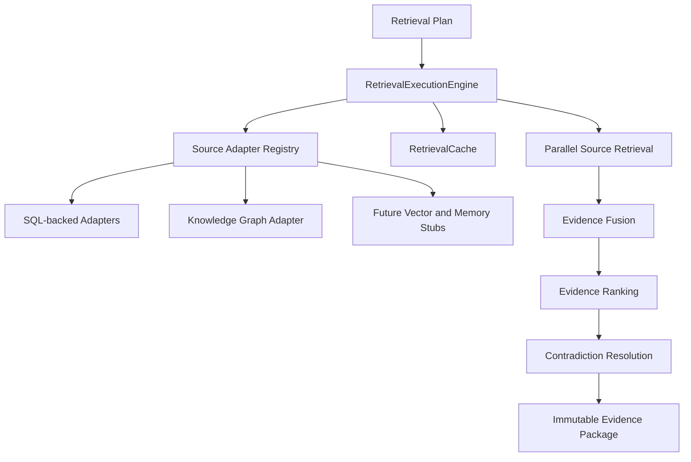

# Hybrid Retrieval Engine

The Hybrid Retrieval Engine executes Retrieval Plans produced by the [Retrieval Planner](retrieval-planner.md). It retrieves evidence from heterogeneous sources, tolerates partial failures, and emits an immutable Evidence Package.

It does not call an LLM, generate prompts, construct final context, create recommendations, or run embeddings.

## Architecture



## Source Adapter Contract

Every adapter implements:

```text
initialize()
supports(source)
estimateCost(source)
retrieve(context)
health()
destroy()
```

Adapters are registered in the adapter registry. The execution engine resolves adapters by source name from the retrieval plan.

## Implemented Adapters

| Adapter | Source |
| --- | --- |
| Behavior Profiles | `behavior_profiles` |
| Behavior Features | `behavior_features` |
| Knowledge Graph | `behavior_knowledge_graph` |
| Behavior Insights | `behavior_insights` |
| Evidence Store | `evidence_store` |
| Contest History | `contest_history` |
| Contest Summaries | `contest_summaries` |
| Session Summaries | `session_summaries` |
| Historical Aggregations | `historical_aggregations` |
| Topic Performance | `topic_performance` |
| Platform Statistics | `platform_statistics` |
| User Metadata | `user_metadata` |
| Feature Versions | `feature_versions` |
| Pattern Evolution | `pattern_evolution` |
| Future Vector Store | `future_vector_store` stub |
| Future Conversation Memory | `future_conversation_memory` stub |

## Execution Semantics

- Sources execute in parallel.
- Each source has timeout protection.
- Each source can retry once by default.
- One source failure does not fail the entire package.
- Cacheable sources are read through the in-memory retrieval cache.
- Source health and reliability are exposed for observability.
- Package statistics record source failures, cache hit rate, retrieval latency, and partial-failure status.

## Graph Retrieval

The knowledge graph adapter retrieves edges from `knowledge_edges` and expands target nodes from `knowledge_nodes`.

Supported graph controls:

- confidence filtering
- version propagation
- relationship-distance scoring
- depth bounds
- cycle protection through visited edge tracking

## Retrieval Cache

The current cache is process-local and TTL-based. It caches graph traversals, profiles, insights, contest summaries, historical aggregations, and pattern evolution results.

The database migration adds `retrieval_cache` for future durable cache storage and invalidation workflows. The current engine keeps cache writes in memory to avoid introducing cross-process invalidation semantics before the cache invalidation contract exists.

## API

Authenticated internal endpoints:

| Method | Path | Purpose |
| --- | --- | --- |
| `POST` | `/api/ai/retrieval/execute` | Execute a retrieval plan and persist an evidence package |
| `GET` | `/api/ai/retrieval/package/:id` | Fetch a persisted evidence package |
| `GET` | `/api/ai/retrieval/cache` | Inspect current process cache stats |
| `GET` | `/api/ai/retrieval/metrics` | Fetch retrieval execution metrics |
| `GET` | `/api/ai/retrieval/sources` | Inspect adapter health |
| `GET` | `/api/ai/retrieval/health` | Inspect retrieval engine health |

