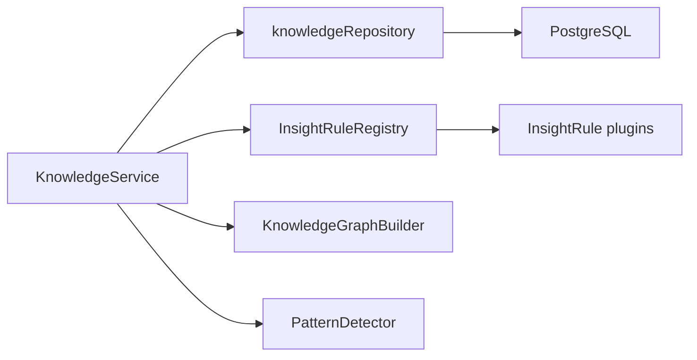
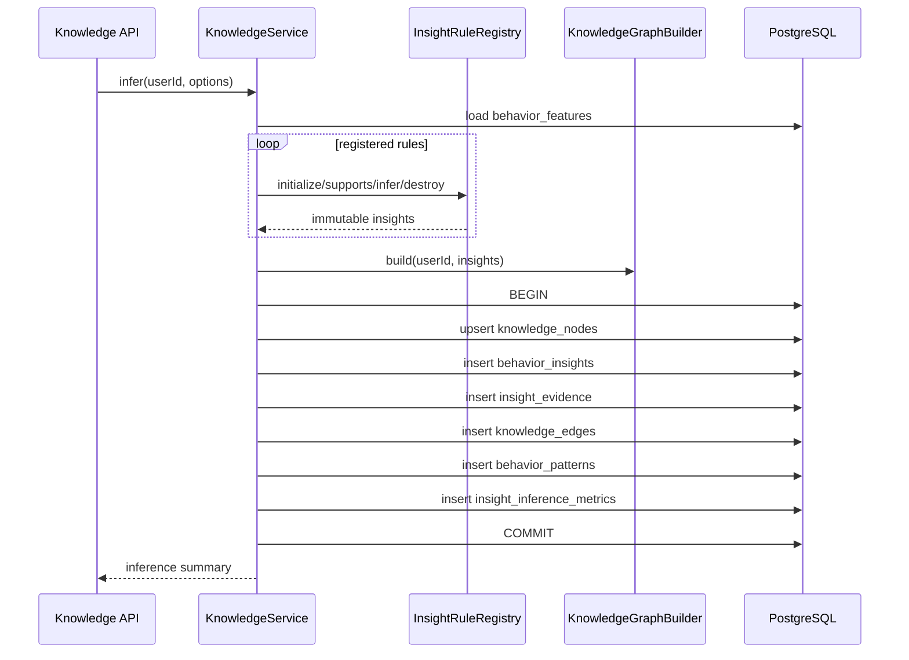

# Insight Engine

The Insight Engine is the rule-based inference subsystem for behavior knowledge. It consumes `behavior_features`, executes registered insight rules, builds graph relationships, persists evidence, detects recurring patterns, and records inference metrics.

## Component Diagram



## Rule Contract

Rules implement the common `InsightRule` contract in `backend/src/knowledge/rules/ruleContract.js`.

```text
initialize()
supports(context)
infer(context)
confidence()
version()
destroy()
```

Rules are interchangeable. Adding a new rule requires implementing the contract and registering it in the rule factory. Existing service, repository, graph, and API code do not need to change.

## Implemented Rules

| Rule | Insight Key | Category | Relationship |
| --- | --- | --- | --- |
| Conceptual Weakness | `conceptual_weakness` | `weakness` | `HAS_WEAKNESS` |
| Recovery Strength | `strong_recovery_ability` | `strength` | `HAS_STRENGTH` |
| Risk Management | `risk_management_weakness` | `weakness` | `HAS_WEAKNESS` |
| Time Management | `strong_time_management` | `strength` | `HAS_STRENGTH` |
| Recurring Late Panic | `repeated_late_panic` | `pattern` | `HAS_PATTERN` |
| Difficulty Avoidance | `difficulty_avoidance` | `pattern` | `HAS_PATTERN` |
| Fast Recognition | `fast_recognition` | `strength` | `HAS_STRENGTH` |

## Inference Lifecycle



## Confidence Model

Each insight confidence is clamped to `[0, 1]` and derived from supporting feature confidence. Pattern confidence is derived from recurring insight confidence. Low-confidence knowledge remains stored because it is evidence-backed, but future recommendation and AI systems should apply their own minimum confidence thresholds.

## Conflict Handling

Rules are independent and may emit contradictory knowledge if evidence supports it. The current implementation prevents one specific false positive by requiring the risk-management rule to see both high risk appetite and late contest panic. Broader conflict resolution is intentionally deferred until downstream analytics need ranking or explanation semantics.

## Observability

Each inference run records:

- Generated insight count.
- Rules fired.
- Inference latency.
- Confidence distribution.
- Graph node and edge counts.
- Pattern count.
- Completion or failure status.

