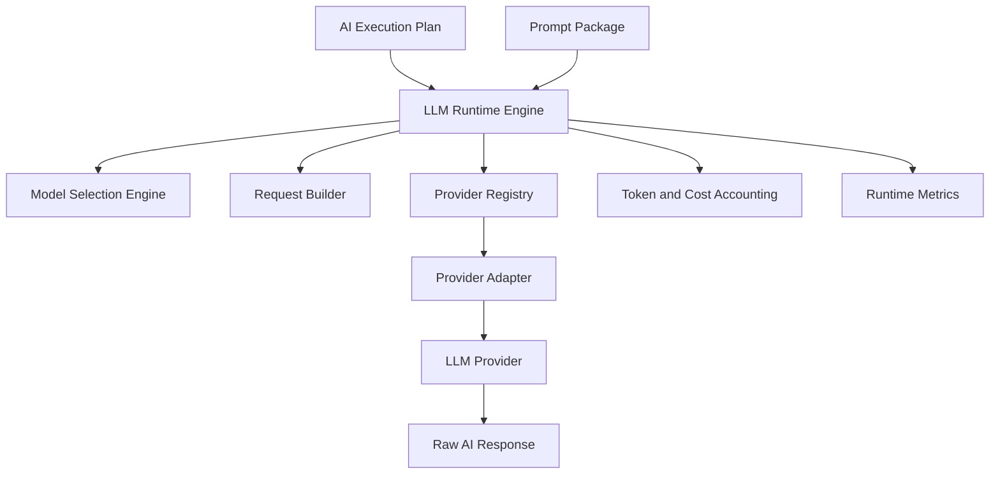

# LLM Runtime Engine

The LLM Runtime Engine executes immutable AI Execution Plans through provider-agnostic LLM adapters. It is the first phase that can invoke model providers.

This phase does not validate responses, inject citations, detect hallucinations, build conversation memory, call tools, use MCP, or run agent workflows.

## Architecture

## Runtime Lifecycle

1. Receive execution plan and prompt package.
2. Select model automatically or honor manual override.
3. Check rate limits.
4. Build provider-specific request.
5. Invoke provider with retry.
6. Fail over when possible.
7. Return raw response.
8. Record tokens, cost, latency, retries, fallbacks, and cancellation state.

Raw prompts and raw completions are not persisted by the runtime repository.

## API

Internal authenticated endpoints:

- `POST /api/ai/runtime/execute`
- `POST /api/ai/runtime/stream`
- `GET /api/ai/runtime/providers`
- `GET /api/ai/runtime/models`
- `GET /api/ai/runtime/metrics`
- `GET /api/ai/runtime/health`
- `POST /api/ai/runtime/cancel`

