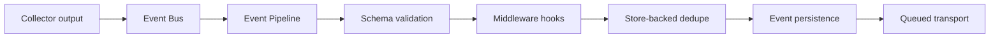
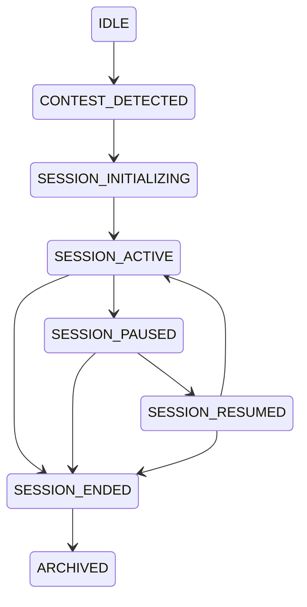
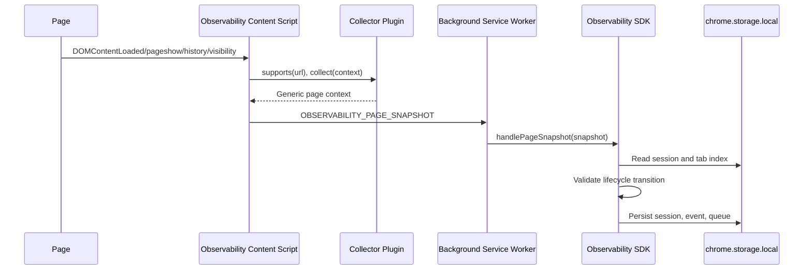

# Observability SDK Architecture

The Observability SDK is a platform-agnostic runtime under `extension/observability`. It exists so contest-session telemetry can scale beyond Codeforces and CodeChef without rewriting lifecycle, persistence, validation, event identity, or transport logic.

The SDK knows nothing about competitive programming platforms. Platform-specific parsing belongs only in collector plugins.

## Why the SDK Exists

Early platform integrations tend to couple DOM parsing, session lifecycle, event shape, persistence, retries, and backend upload into one code path. That design does not scale to many platforms or future clients. CPInsight instead uses a generic SDK:

- Collectors translate page state into generic page context.
- The SDK owns session lifecycle and event handling.
- Persistence and transport are SDK services, not collector concerns.
- Future platforms add a collector and registration only.

## Component Diagram

```mermaid
classDiagram
  class ObservabilitySDK {
    +registerCollector(collector)
    +initialize(context)
    +handlePageSnapshot(snapshot)
    +handlePageExit(payload)
    +handleTabClosed(tabId)
    +recoverUnfinishedSessions(reason)
  }
  class CollectorRegistry {
    +register(collector)
    +initializeAll(context)
    +findForUrl(url)
    +list()
  }
  class SessionEngine {
    +handlePageSnapshot(snapshot)
    +detachTab(tabId, url, reason)
    +handleTabClosed(tabId)
    +recoverUnfinishedSessions(reason)
  }
  class LifecycleManager {
    +transition(session, nextState, metadata)
    +canTransition(from, to)
  }
  class EventBus {
    +emit(event)
    +subscribe(listener)
  }
  class EventPipeline {
    +use(middleware)
    +process(event)
  }
  class PersistentStore {
    +ensureReady()
    +upsertSession(session)
    +replaceSession(session)
    +appendEvent(event)
    +enqueue(event)
  }
  class QueuedTransport {
    +publish(event)
  }

  ObservabilitySDK --> CollectorRegistry
  ObservabilitySDK --> SessionEngine
  ObservabilitySDK --> PersistentStore
  SessionEngine --> LifecycleManager
  SessionEngine --> EventBus
  EventBus --> EventPipeline
  EventBus --> QueuedTransport
  EventPipeline --> PersistentStore
```



## Collector Plugin Contract

Collectors implement:

```text
id
platform
initialize(context)
supports(url)
collect(context)
pause()
resume()
destroy()
```

The SDK validates this contract before registration. The contract is intentionally small. Collectors are interchangeable because the SDK does not call platform-specific methods.

## Event Pipeline



Implemented middleware support is generic. The current pipeline normalizes events, validates schema, runs registered middleware, checks duplicate keys against storage, freezes event objects, then returns an immutable event to the bus.

## Event Schema

All emitted events use the same schema:

```json
{
  "eventId": "uuid",
  "sessionId": "contest_session_...",
  "userId": null,
  "platform": "codeforces",
  "contestId": "1999",
  "contestName": "Codeforces Round 1999",
  "problemId": "A:A",
  "eventType": "PROBLEM_OPENED",
  "timestamp": "2026-07-22T12:00:00.000Z",
  "pageUrl": "https://codeforces.com/contest/1999/problem/A",
  "metadata": {}
}
```

Platform-specific details may be placed inside `metadata`, but the top-level schema does not change per platform.

## Session Lifecycle



The Lifecycle Manager validates every transition. Illegal transitions throw errors instead of silently producing inconsistent state.

## Contest Detection Sequence



## Persistence

The SDK stores:

- `observability.sessions`
- `observability.events`
- `observability.queue`
- `observability.tabIndex`
- `observability.metadata`

Storage shape is validated before use. Invalid shapes are replaced with safe defaults and logged.

## Transport and Upload

`QueuedTransport` durably queues events as part of the SDK event pipeline. Phase 2.1 adds an upload layer on top of that queue: the upload scheduler assigns stable upload sequence numbers, builds bounded batches, sends them through authenticated HTTP, and removes only backend-acknowledged event ids. WebSocket, gRPC, desktop bridge, or mobile bridge transports can still be added behind the transport boundary without changing collectors.

## Why There Is No Platform Logic in the SDK

The SDK is closed to platform-specific modification. Platform names, hostnames, URL shapes, and DOM selectors live in `extension/observability/platforms/*`. This follows the Open/Closed Principle: future support for LeetCode telemetry, AtCoder, HackerRank, HackerEarth, VS Code, desktop, or mobile clients should add adapters or collectors without changing lifecycle or event core.

Related ADRs:

- [ADR-0001](../decisions/ADR-0001-platform-agnostic-observability-sdk.md)
- [ADR-0002](../decisions/ADR-0002-plugin-collector-architecture.md)
- [ADR-0006](../decisions/ADR-0006-event-pipeline.md)
