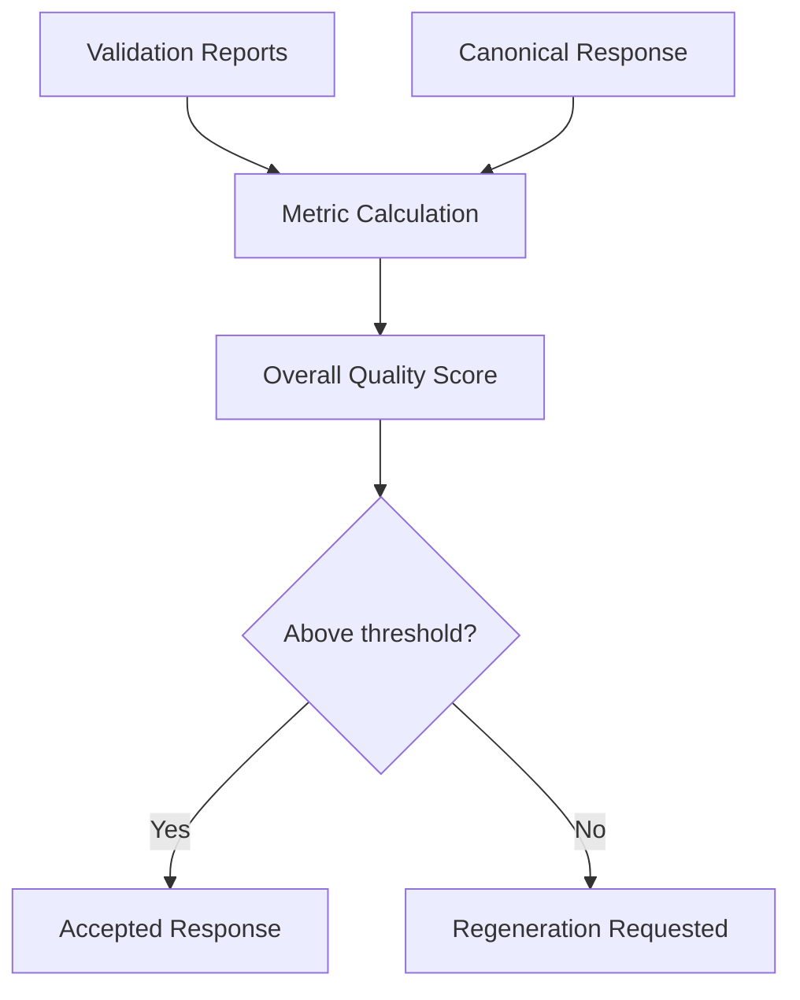

# Quality Evaluation

Quality Evaluation scores a validated response after schema, grounding, citation, recommendation, confidence, and consistency checks have run. The score is used for acceptance, regeneration decisions, reflection eligibility, and future provider and strategy comparisons.

## Quality Metrics

| Metric | Meaning |
| --- | --- |
| Grounding coverage | Fraction of observations and inferences backed by evidence |
| Citation quality | Fraction of citations that reference known evidence |
| Recommendation support | Fraction of recommendations supported by evidence |
| Actionability | Whether recommendations are specific enough to act on |
| Readability | Structural clarity of the normalized response |
| Completeness | Coverage of observations, inferences, recommendations, and summary |
| Conciseness | Penalty for oversized summaries or excessive item counts |
| Contradiction count | Count of internal consistency failures |
| Overall quality score | Weighted aggregate used by the validation pipeline |

## Evaluation Flow

## Determinism

The evaluator is deterministic. Given the same raw response, evidence package, and reasoning context, it returns the same scores. No external model, random sampling, or provider state is used.

## Observability

Validation metrics are persisted to `validation_metrics`, including:

- validation latency
- grounding failures
- citation failures
- confidence mismatch
- recommendation rejections
- reflection count
- regeneration count
- status and error message

Feedback trends are tracked separately by the [Human Feedback](human-feedback.md) subsystem.
