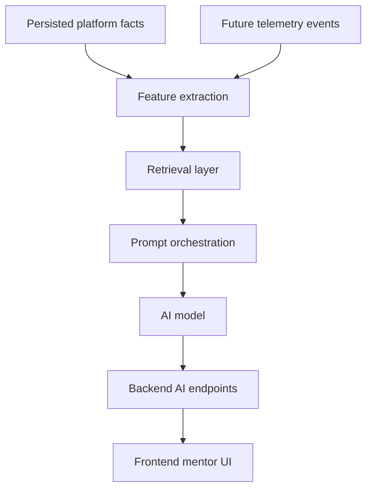

# Future AI and RAG Roadmap

This document describes planned architecture only. The current repository contains an `backend/src/services/ai/README.md`, but no implemented RAG pipeline, vector database integration, AI mentor, or recommendation engine.

## Planned Layers

## Candidate Capabilities

- Explain weak topics using solved and attempted submissions.
- Recommend practice problems based on tags, difficulty, and recent mistakes.
- Summarize contest behavior after realtime telemetry ingestion exists.
- Generate study plans from historical consistency and rating trends.

## Required Foundations Before Implementation

- Backend telemetry ingestion.
- Raw event retention strategy.
- User-consented data usage policy.
- Prompt and response logging policy.
- Evaluation datasets.
- Recommendation correctness metrics.

## Boundaries

AI features must not scrape platform pages directly. They should consume normalized backend facts and consented telemetry. RAG should not bypass repository services or database access controls.
