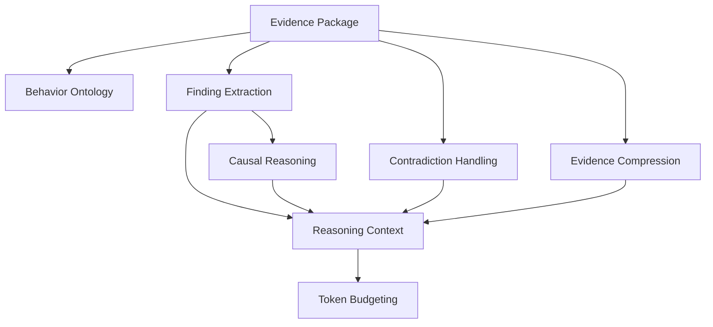

# Reasoning Context Engine

The Reasoning Context Engine transforms immutable Evidence Packages into ontology-backed Reasoning Contexts. It performs deterministic interpretation only; it does not invoke LLMs, generate chat responses, create embeddings, stream output, or implement autonomous agents.

## Architecture

## Context Contents

A Reasoning Context contains:

- user profile placeholder
- primary findings
- secondary findings
- behavior evolution
- causal chains
- strengths
- weaknesses
- evidence summary
- historical comparison
- contradictions
- missing evidence
- confidence
- ontology metadata
- token budget decisions
- reasoning metadata

## Finding Extraction

Findings group ranked evidence by ontology concept and finding type. Findings are ranked by:

- confidence
- evidence count
- freshness
- evidence rank score
- ontology mapping quality

## Causal Reasoning

Causal chains are deterministic directed graphs over ontology concepts. Implemented templates include:

- `time_allocation -> panic -> implementation_errors`
- `risk_taking -> panic -> time_mismanagement`
- `persistence -> recovery_strategy -> rapid_improvement`
- `deep_reading -> conceptual_weakness -> decision_delay`
- `difficulty_avoidance -> plateau`
- `fast_recognition -> confidence -> topic_mastery`

Chains are emitted only when at least two concepts are supported by evidence.

## Contradiction Handling

The context separates:

- confirmed findings
- weak findings
- conflicting findings
- findings needing more evidence

Contradictions from Evidence Fusion are carried forward and never hidden.

## Evidence Compression

Evidence is grouped into source/type clusters. Long evidence chains are compressed into representative evidence IDs and cluster summaries. Tight token budgets also compress discarded evidence identifiers, secondary findings, ontology labels, and budget decision logs.

## Token Budgets

Supported budgets:

- `4k`
- `8k`
- `16k`
- `32k`
- `128k`
- `unlimited`

The engine reserves completion tokens and trims lowest-priority evidence first.

