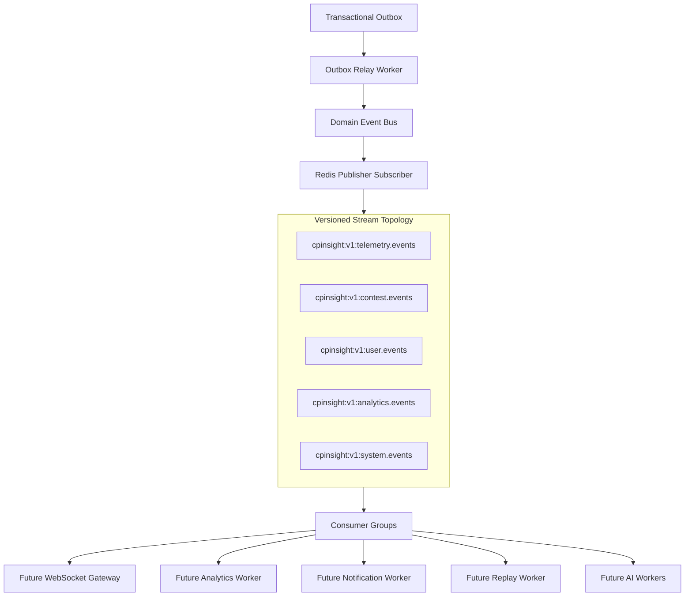

# Redis Event Distribution

Redis Event Distribution is the distributed transport layer for backend domain events. The Domain Event Bus remains the application abstraction; Redis Streams are the transport used by distributed consumers.

## Architecture



No consumer reads directly from the outbox. Consumers attach to Redis streams through consumer groups.

## Stream Topology

| Stream | Purpose |
| --- | --- |
| `cpinsight:v1:telemetry.events` | Telemetry session and problem-navigation events. |
| `cpinsight:v1:contest.events` | Future contest domain facts. |
| `cpinsight:v1:user.events` | Future user/account/profile facts. |
| `cpinsight:v1:analytics.events` | Future analytics lifecycle facts. |
| `cpinsight:v1:system.events` | Fallback stream for generic system events. |

The `v1` segment is the stream topology version. Schema evolution should add new event versions or stream versions without changing existing consumers in place.

## Publisher

The Redis publisher is registered as a Domain Event Bus subscriber. When Redis event distribution is enabled, the Outbox Relay treats `redis-event-publisher` as a required subscriber. If Redis publication fails, the outbox row is not marked `published`; it is retried by the relay.

Publisher behavior:

- Maps events to streams by aggregate type and event type.
- Writes immutable domain event payloads with `XADD`.
- Uses approximate `MAXLEN` trimming.
- Supports batch publishing through Redis pipelines.
- Tracks publish count, failures, latency, and last publish time.

## Consumer Framework

Redis consumers use a reusable framework with this lifecycle:

```text
initialize()
consume()
consumeOnce()
ack()
retryOrDeadLetter()
shutdown()
```

Consumers are expected to implement a handler with:

```text
consume({ id, stream, event, raw })
```

The framework owns Redis Consumer Group mechanics, acknowledgement, pending recovery, dead-letter routing, and health metrics.

## Consumer Groups

Consumer groups provide:

- Horizontal load balancing.
- Pending entry lists.
- Recovery with `XAUTOCLAIM`.
- Batch acknowledgement with `XACK`.
- Consumer reassignment after idle timeout.

Duplicate consumers in the same group divide work; consumers in different groups each receive their own copy of the stream.

## Failure Recovery

| Failure | Recovery |
| --- | --- |
| Redis reconnect | Connection manager retries according to Redis client policy. |
| Publisher failure | Required subscriber failure causes outbox retry. |
| Consumer crash | Pending entries remain in Redis and are reclaimed with `XAUTOCLAIM`. |
| Duplicate consumer | Consumer groups load-balance messages. |
| Poison message | Consumer routes exhausted retries to `<stream>.dead-letter`. |
| Large backlog | Consumers read batches and acknowledge in batches. |

## Observability

Tracked by framework metrics:

- Published events.
- Consumed events.
- Acknowledged events.
- Pending recovered entries.
- Retries.
- Failures.
- Publish latency.
- Heartbeat timestamp.

Future production monitoring should additionally query stream length, group lag, pending counts, and dead-letter stream size from Redis.

## Runtime Verification

```powershell
cd backend
node scripts/verify-redis-event-distribution.js
```

The harness verifies stream routing, batch publishing, consumer groups, acknowledgement, pending recovery, dead-letter routing, duplicate consumer load balancing, large backlog publication, and heartbeat behavior.
