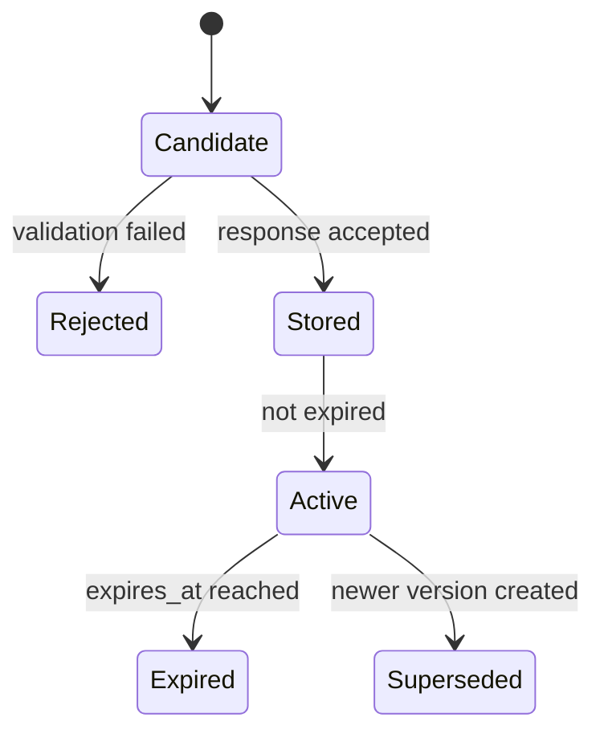

# Reflection Memory

Reflection Memory stores validated, evidence-backed behavioral reflections extracted from accepted AI Coach responses. It is not conversation memory and it does not store raw chat transcripts.

Reflections are structured behavioral records that can later become retrieval sources for coaching, trend analysis, and longitudinal personalization.

## Reflection Object

```json
{
  "type": "weakness",
  "behaviorFinding": "panic",
  "supportingEvidence": ["e1", "e2"],
  "confidence": 0.86,
  "createdAt": "2026-07-23T00:00:00.000Z",
  "expires": "2026-10-21T00:00:00.000Z",
  "importance": 0.78,
  "version": 1
}
```

## Lifecycle



Only reflections generated from validated responses are stored. Each reflection keeps evidence links so future systems can trace the behavioral claim back to deterministic evidence.

## Storage

The schema is split to preserve auditability:

- `reflection_memory`: canonical reflection records per user.
- `reflection_versions`: reflection type and version metadata.
- `reflection_links`: evidence identifiers supporting each reflection.

## Boundaries

Reflection Memory does not:

- write to the Evidence Package;
- alter Behavior Knowledge rows;
- modify planner output;
- train models;
- store private conversation history.

It stores only validated, evidence-backed behavioral summaries.
