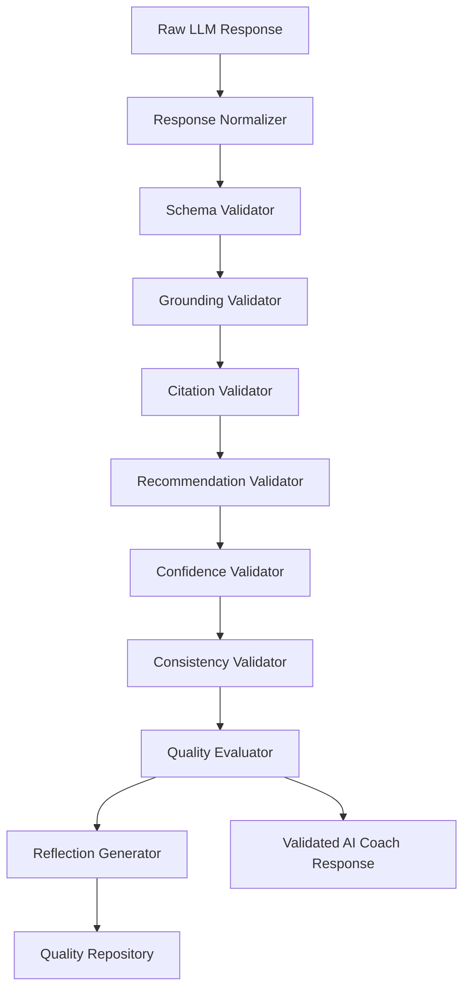

# Response Validation

The Response Validation layer transforms raw provider output from the [LLM Runtime](llm-runtime.md) into a canonical, validated AI Coach response. It is the first layer after provider invocation and the last layer before a response can be treated as user-facing AI output.

This layer does not call LLMs, alter retrieval evidence, update planner output, or create conversation memory. Its responsibility is deterministic validation, repair where safe, quality scoring, reflection extraction, and persistence.

## Architecture



## Canonical Response

After normalization, every provider response is represented as:

```json
{
  "observations": [],
  "inferences": [],
  "recommendations": [],
  "citations": [],
  "confidence": 0.78,
  "uncertainty": [],
  "summary": "",
  "metadata": {}
}
```

Provider-specific response structures are allowed only before normalization. Downstream validators operate on the canonical schema.

## Validation Responsibilities

| Component | Responsibility |
| --- | --- |
| Response Normalizer | Converts JSON or text provider output into the canonical response shape |
| Schema Validator | Validates arrays, strings, confidence range, and maximum summary length |
| Grounding Validator | Requires observations and inferences to map to evidence identifiers |
| Citation Validator | Rejects references that do not exist in the Evidence Package or Reasoning Context |
| Recommendation Validator | Requires every recommendation to cite supporting evidence |
| Confidence Validator | Compares model confidence with deterministic confidence and clamps impossible values |
| Consistency Validator | Detects duplicated claims and unsupported internal contradictions |
| Quality Evaluator | Scores grounding, citations, support, actionability, readability, completeness, and conciseness |

## Regeneration Policy

The validation report can request regeneration when deterministic checks fail. The policy is bounded and declarative:

- Schema failure: deterministic repair is attempted first.
- Grounding failure: regeneration is requested when unsupported observations remain.
- Citation failure: regeneration is requested for fabricated references.
- Recommendation failure: regeneration is requested for unsupported recommendations.
- Retry count is capped by configuration.

The validator does not invoke a model. Regeneration execution belongs to a future orchestration layer.

## Persistence

Validated output and reports are persisted through `qualityRepository` into:

- `validated_responses`
- `response_quality`
- `validation_metrics`

Raw provider secrets are never persisted. Reflection objects are stored separately after validation, as described in [Reflection Memory](reflection-memory.md).

## API

Internal authenticated endpoints:

- `POST /api/ai/validate`
- `GET /api/ai/quality/:id`
- `GET /api/ai/validation/metrics`

See [API Reference](../api/README.md#ai-quality) for request and response examples.

## Verification

Runtime verification is implemented in `backend/scripts/verify-ai-quality.js`. It covers malformed responses, grounding failures, citation failures, recommendation failures, confidence clamping, deterministic validation, reflection creation, human feedback, regeneration requests, and 1000 raw response validations.
