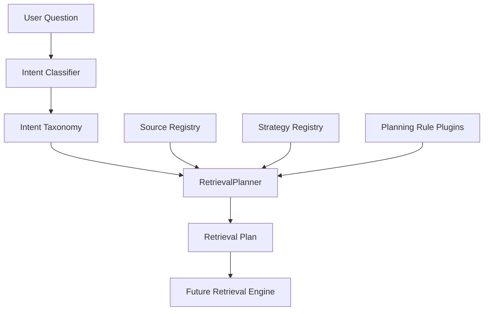

# Retrieval Planner

The Retrieval Planner converts an intent classification into a structured retrieval plan. It does not execute retrieval, query a vector database, build prompts, call an LLM, or generate answers.

## Architecture



## Retrieval Plan

A plan contains:

- `planId`
- `questionHash`
- primary and secondary intents
- required evidence types
- selected retrieval sources
- selected retrieval strategies
- confidence requirements
- evidence sufficiency status
- token budget estimate
- estimated latency and cost
- execution priority

Evidence sufficiency is `requires_retrieval` when the planner can identify relevant sources but cannot yet verify actual evidence rows. It is `insufficient` for unknown questions or unsupported plans.

## Source Registry

Sources expose:

- `name`
- `supportsIntent(intent)`
- `estimatedCost`
- `estimatedLatencyMs`
- `requiredConfidence`
- default retrieval limit
- context token estimate

Implemented source metadata includes behavior profiles, behavior features, behavior knowledge graph, behavior insights, evidence store, contest history, contest summaries, session summaries, historical aggregations, user metadata, topic performance, platform statistics, feature versions, pattern evolution, future vector store, and future conversation memory.

Future sources require registration only.

## Strategy Registry

Strategies expose:

- `name`
- supported intents
- description
- priority
- context multiplier

Implemented strategy metadata includes knowledge graph traversal, behavior profile lookup, historical window retrieval, evidence chain retrieval, contest timeline retrieval, session reconstruction retrieval, trend aggregation, SQL retrieval, hybrid retrieval, and future semantic retrieval.

## Planning Rules

Planning rules are plugins with this contract:

```text
initialize()
supportsIntent(intent)
plan(context)
priority()
version()
destroy()
```

Rules are responsible for mapping one intent to required evidence, preferred source ordering, preferred strategies, confidence requirements, minimum supporting sessions, and minimum historical coverage.

## Persistence

Migration `011_intent_retrieval_planner.sql` adds:

- `planner_rule_versions`
- `intent_classifications`
- `retrieval_plans`
- `planner_metrics`

The API stores question hashes, intent classifications, selected sources, strategies, confidence plans, token budgets, estimates, and planner metrics.

## Internal API

Authenticated internal endpoints:

| Method | Path | Purpose |
| --- | --- | --- |
| `POST` | `/api/ai/planner/classify` | Classify a question |
| `POST` | `/api/ai/planner/plan` | Produce and persist a retrieval plan |
| `GET` | `/api/ai/planner/intents` | List supported intents |
| `GET` | `/api/ai/planner/sources` | List source metadata |
| `GET` | `/api/ai/planner/strategies` | List strategy metadata |

## Boundaries

The planner intentionally excludes:

- vector search
- embeddings
- data retrieval
- context construction
- prompt generation
- chat
- recommendations
- LLM calls

Future retrieval engines should consume retrieval plans rather than reclassifying questions.

