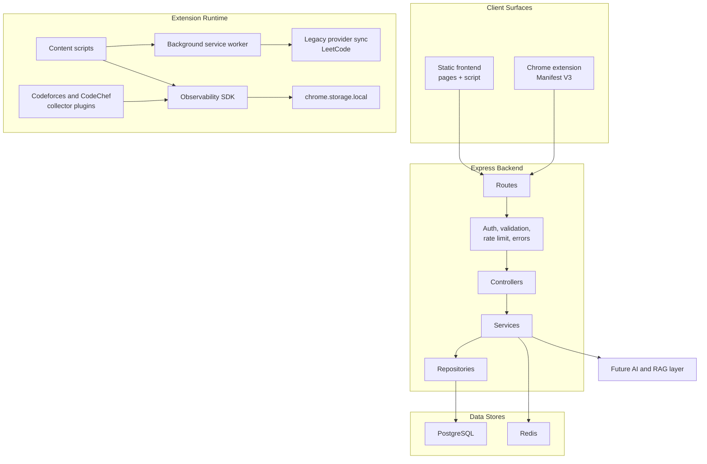
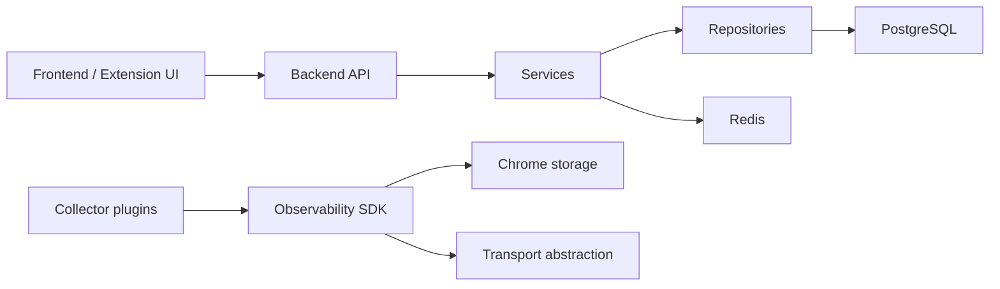

# System Overview

CPInsight is a layered analytics system for competitive programming data. It uses a web frontend for user interaction, an Express API for authenticated business operations, PostgreSQL for durable domain data, Redis for cache acceleration, and a Chrome extension for authenticated browser-side collection and contest-session detection.

The design separates data acquisition from analytics. Platform clients and extension collectors gather facts. Backend services normalize and persist facts. Analytics services read persisted facts and produce views. The Observability SDK provides a newer platform-agnostic foundation for telemetry events without coupling collectors to storage or transport.

## Runtime Architecture

## Implemented Subsystems

| Subsystem | Location | Responsibility |
| --- | --- | --- |
| Frontend | `pages/`, `script/`, `css/` | Browser UI for auth, dashboard, analytics, profile, platform accounts, and comparison views |
| Backend API | `backend/src/routes`, `controllers`, `services` | Authenticated HTTP API, validation, orchestration, platform sync, analytics, extension uploads |
| Persistence | `backend/src/database`, `repositories` | PostgreSQL tables and SQL access |
| Cache | `backend/src/redis`, `analyticsService` | Redis read-through cache for analytics where safe |
| Chrome extension | `extension/` | Manifest V3 extension, popup, background orchestration, content scripts, LeetCode provider sync, observability bridge |
| Observability SDK | `extension/observability/` | Generic event/session/lifecycle/persistence/transport foundation |
| Platform collectors | `extension/observability/platforms/` | DOM and URL parsing for Codeforces and CodeChef contest sessions |

## Dependency Direction

The backend does not depend on the frontend. The Observability SDK does not depend on Codeforces, CodeChef, LeetCode, or any future platform. Collectors depend on the SDK contract, not the other way around.

## Data Flow Categories

1. Authentication flow: user credentials are validated by the backend; access and refresh tokens are returned to the frontend or extension.
2. Platform sync flow: backend services call platform clients and write normalized account, contest, and submission facts.
3. LeetCode extension upload flow: extension sends an authenticated collection payload to `/api/extension/leetcode/collection`; backend validates idempotency and persists facts.
4. Observability flow: content scripts emit page snapshots; SDK sessions and events are persisted locally; backend ingestion is not implemented yet.
5. Analytics flow: frontend requests analytics; backend reads database facts, optionally uses Redis/PostgreSQL cache, and returns computed payloads.

## Current and Future Boundaries

Implemented telemetry stops at durable local SDK event creation. It does not upload contest-session telemetry to the backend. Future backend telemetry ingestion should be added behind the existing transport abstraction and documented in [Telemetry](telemetry.md) and [ADR-0008](../decisions/ADR-0008-transport-abstraction.md).
