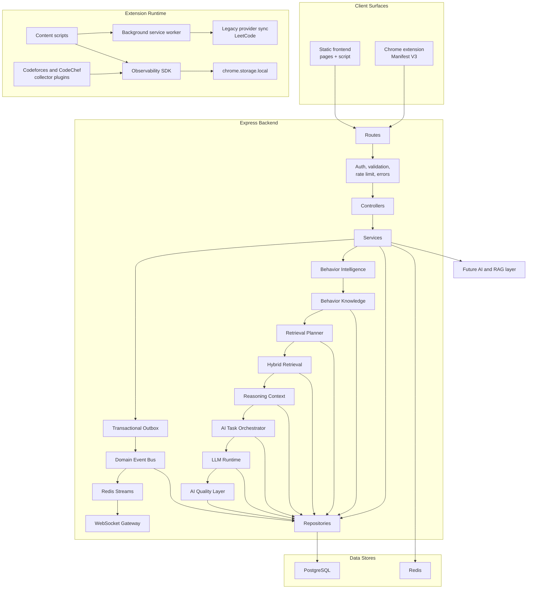
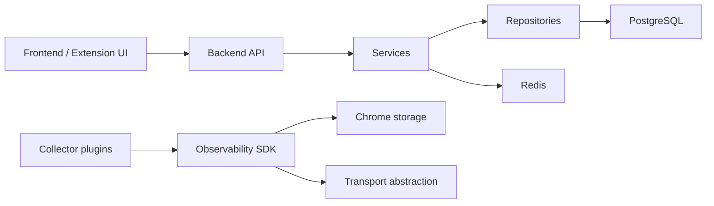

# System Overview

CPInsight is a layered analytics system for competitive programming data. It uses a web frontend for user interaction, an Express API for authenticated business operations, PostgreSQL for durable domain data, Redis for cache acceleration, and a Chrome extension for authenticated browser-side collection and contest-session detection.

The design separates data acquisition from analytics. Platform clients and extension collectors gather facts. Backend services normalize and persist facts. Analytics services read persisted facts and produce views. The Observability SDK provides a newer platform-agnostic foundation for telemetry events without coupling collectors to storage or transport. The backend [Transactional Outbox](transactional-outbox.md), [Domain Event Bus](domain-event-bus.md), [Redis Event Distribution](redis-event-distribution.md), [WebSocket Gateway](websocket-gateway.md), [Behavior Intelligence](behavior-intelligence.md), [Behavior Knowledge Layer](behavior-knowledge.md), [Retrieval Planner](retrieval-planner.md), [Hybrid Retrieval Engine](hybrid-retrieval.md), [Reasoning Context Engine](reasoning-context-engine.md), [AI Task Orchestrator](task-orchestrator.md), [LLM Runtime](llm-runtime.md), and [AI Quality Layer](response-validation.md) decouple committed facts from downstream consumers.

## Runtime Architecture

## Implemented Subsystems

| Subsystem | Location | Responsibility |
| --- | --- | --- |
| Frontend | `pages/`, `script/`, `css/` | Browser UI for auth, dashboard, analytics, profile, platform accounts, and comparison views |
| Backend API | `backend/src/routes`, `controllers`, `services` | Authenticated HTTP API, validation, orchestration, platform sync, analytics, extension uploads |
| Transactional Outbox | `backend/src/domain-events/outbox` | Durable post-commit relay for domain events |
| Domain Event Bus | `backend/src/domain-events` | Generic publish/subscribe backbone for processed backend facts |
| Redis Event Distribution | `backend/src/redis/events` | Redis Streams publisher and consumer framework for distributed domain event delivery |
| WebSocket Gateway | `backend/src/realtime` | Authenticated realtime event delivery from Redis Streams to subscribed clients |
| Behavior Intelligence | `backend/src/behavior`, `backend/src/services/behaviorService.js` | Session reconstruction, feature extraction, behavior profiles |
| Behavior Knowledge | `backend/src/knowledge`, `backend/src/services/knowledgeService.js` | Rule-based insight inference, knowledge graph persistence, behavior patterns, evidence records |
| Retrieval Planner | `backend/src/ai/planner`, `backend/src/services/plannerService.js` | Intent classification and retrieval planning without retrieval or LLM calls |
| Hybrid Retrieval | `backend/src/ai/retrieval`, `backend/src/services/retrievalService.js` | Source adapter execution, evidence fusion, ranking, contradiction detection, immutable evidence packages |
| Reasoning Context | `backend/src/ai/reasoning`, `backend/src/services/reasoningService.js` | Ontology-backed findings, causal chains, compression, token budgeting, provider-independent prompt packages |
| AI Task Orchestrator | `backend/src/ai/tasks`, `backend/src/services/taskService.js` | Task routing, prompt strategies, schemas, policies, immutable AI execution plans |
| LLM Runtime | `backend/src/ai/runtime`, `backend/src/services/runtimeService.js` | Provider-agnostic LLM invocation, model selection, streaming collection, retries, failover, token and cost accounting |
| AI Quality Layer | `backend/src/ai/quality`, `backend/src/services/qualityService.js` | Response normalization, grounding validation, citation checks, quality evaluation, reflection memory, human feedback |
| Persistence | `backend/src/database`, `repositories` | PostgreSQL tables and SQL access |
| Cache | `backend/src/redis`, `analyticsService` | Redis read-through cache for analytics where safe |
| Chrome extension | `extension/` | Manifest V3 extension, popup, background orchestration, content scripts, LeetCode provider sync, observability bridge |
| Observability SDK | `extension/observability/` | Generic event/session/lifecycle/persistence/transport foundation |
| Platform collectors | `extension/observability/platforms/` | DOM and URL parsing for Codeforces and CodeChef contest sessions |

## Dependency Direction

The backend does not depend on the frontend. The Observability SDK does not depend on Codeforces, CodeChef, LeetCode, or any future platform. Collectors depend on the SDK contract, not the other way around.

## Data Flow Categories

1. Authentication flow: user credentials are validated by the backend; access and refresh tokens are returned to the frontend or extension.
2. Platform sync flow: backend services call platform clients and write normalized account, contest, and submission facts.
3. LeetCode extension upload flow: extension sends an authenticated collection payload to `/api/extension/leetcode/collection`; backend validates idempotency and persists facts.
4. Observability flow: content scripts emit page snapshots; SDK sessions and events are persisted locally, batched, uploaded, processed, published as domain events, acknowledged, and stored by the backend telemetry ingestion API.
5. Analytics flow: frontend requests analytics; backend reads database facts, optionally uses Redis/PostgreSQL cache, and returns computed payloads.

## Current and Future Boundaries

Implemented telemetry includes durable local SDK event creation, authenticated backend upload, backend processing, and publication to the Domain Event Bus. Realtime WebSockets, live dashboards, and analytics derived from telemetry remain future work and are documented in [Future Roadmap](future-roadmap.md).
