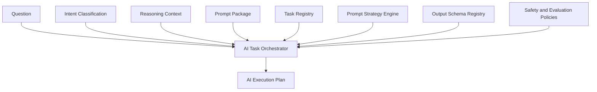

# AI Task Orchestrator

The AI Task Orchestrator determines which AI task should execute for a prepared question, intent classification, Reasoning Context, and Prompt Package. It produces an immutable AI Execution Plan.

It does not invoke an LLM, stream output, call provider SDKs, use embeddings, generate responses, or implement chat.

## Architecture



## Task Registry

Tasks implement:

```text
initialize()
supports()
priority()
reasoningMode()
responseSchema()
promptStrategy()
evaluationRules()
safetyPolicies()
version()
destroy()
```

Implemented task plugins:

- Diagnostic
- Comparative Analysis
- Contest Reflection
- Contest Review
- Coaching
- Learning Roadmap
- Goal Planning
- Trend Analysis
- Prediction
- Recommendation
- Evidence Explanation
- Behavior Explanation
- Topic Analysis
- Strength Analysis
- Weakness Analysis
- Session Review
- Historical Review
- Progress Evaluation
- Motivational Coaching
- Meta Analysis
- General QA
- Unknown

## Routing

Routing is deterministic. Priority uses:

- matched intent
- question keywords
- reasoning confidence
- planner confidence
- missing evidence penalty
- historical availability

The orchestrator supports single-task routing, multi-task routing, hierarchical routing, and task chaining.

## AI Execution Plan

An execution plan contains:

- execution plan id and version
- question hash
- reasoning context id
- prompt package id
- primary task
- task chain
- reasoning modes
- prompt strategies
- output schemas
- evaluation rules
- safety constraints
- execution metadata

