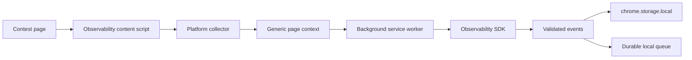

# Telemetry Architecture

Telemetry currently has two distinct paths:

1. Implemented LeetCode extension upload path.
2. Implemented local Observability SDK event/session detection path.

Backend ingestion of Observability SDK events is planned but not yet implemented.

## Current LeetCode Upload Path

The extension collects authenticated LeetCode profile and progress data through the legacy provider flow. It uploads a merged dataset to:

```text
POST /api/extension/leetcode/collection
```

The backend validates account ownership, payload completeness, collector version, upload session id, and idempotency before writing LeetCode facts.

## Current Observability SDK Path



This path detects contest sessions and problem transitions for Codeforces and CodeChef. It does not upload those events to the backend.

## Standard Event Schema

The SDK emits:

- `eventId`
- `sessionId`
- `userId`
- `platform`
- `contestId`
- `contestName`
- `problemId`
- `eventType`
- `timestamp`
- `pageUrl`
- `metadata`

Event identity uses UUIDs. Deduplication is handled separately through metadata dedupe keys.

## Future Telemetry Ingestion

The future backend telemetry API should:

- Accept batches of schema-validated events.
- Authenticate the user.
- Preserve idempotency by event id and dedupe key.
- Store raw events before analytics derivation.
- Keep analytics computation separate from ingestion.
- Support replay and backfill.

The SDK already has a transport abstraction for this future path.
