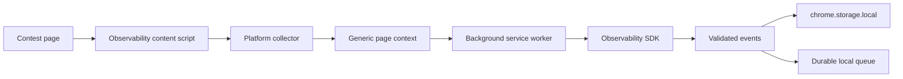
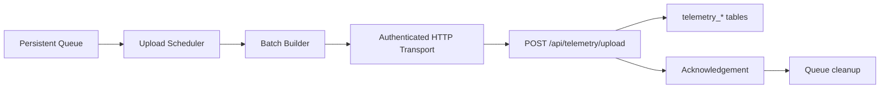

# Telemetry Architecture

Telemetry currently has three distinct paths:

1. Implemented LeetCode extension upload path.
2. Implemented local Observability SDK event/session detection path.
3. Implemented Observability SDK telemetry upload path.

Backend ingestion of Observability SDK events is implemented at `/api/telemetry/upload`.

## Current LeetCode Upload Path

The extension collects authenticated LeetCode profile and progress data through the legacy provider flow. It uploads a merged dataset to:

```text
POST /api/extension/leetcode/collection
```

The backend validates account ownership, payload completeness, collector version, upload session id, and idempotency before writing LeetCode facts.

## Current Observability SDK Path



This path detects contest sessions and problem transitions for Codeforces and CodeChef.

## Observability SDK Upload Path



The extension upload scheduler periodically inspects the durable queue, assigns stable upload sequence numbers to unsequenced events, builds ordered batches, sends them over authenticated HTTP, and removes only acknowledged event ids.

Retry policy:

- Exponential backoff starts at 1 second.
- Delay doubles through 2, 4, 8, and 16 seconds.
- Maximum delay is 30 seconds.
- Jitter is applied.
- `Retry-After` is respected for retryable HTTP responses.
- Retry state is persisted in Chrome storage.

## Batch Format

```json
{
  "batchId": "uuid",
  "sequenceNumber": 1,
  "createdAt": "2026-07-22T12:00:00.000Z",
  "sdkVersion": "observability-sdk-v1",
  "schemaVersion": 1,
  "collectorVersion": "codeforces-contest-session",
  "events": [
    {
      "sequenceNumber": 1,
      "event": {
        "eventId": "uuid",
        "sessionId": "contest_session_...",
        "userId": null,
        "platform": "codeforces",
        "contestId": "1999",
        "contestName": "Contest",
        "problemId": "A:A",
        "eventType": "PROBLEM_OPENED",
        "timestamp": "2026-07-22T12:00:00.000Z",
        "pageUrl": "https://codeforces.com/contest/1999/problem/A",
        "metadata": {}
      }
    }
  ]
}
```

## Standard Event Schema

The SDK emits:

- `eventId`
- `sessionId`
- `userId`
- `platform`
- `contestId`
- `contestName`
- `problemId`
- `eventType`
- `timestamp`
- `pageUrl`
- `metadata`

Event identity uses UUIDs. Deduplication is handled separately through metadata dedupe keys.

## Backend Telemetry Ingestion

The backend telemetry API:

- Accepts batches of schema-validated events.
- Authenticate the user.
- Preserves idempotency by event id and batch id.
- Stores raw events before analytics derivation.
- Keeps analytics computation separate from ingestion.
- Returns acknowledged event ids and highest sequence number.

## Processing Pipeline

Every uploaded event passes through the backend telemetry processing pipeline before durable storage is acknowledged.

```mermaid
flowchart LR
  API["Telemetry API"] --> Ingress["Ingress Validation"]
  Ingress --> Schema["Schema Version"]
  Schema --> Auth["Authentication Context"]
  Auth --> Ordering["Ordering Verification"]
  Ordering --> Idempotency["Idempotency Check"]
  Idempotency --> Timestamps["Timestamp Normalization"]
  Timestamps --> Enrichment["Metadata Enrichment"]
  Enrichment --> Classification["Event Classification"]
  Classification --> Persistence["Raw + Processed Persistence"]
  Persistence --> Outbox["Transactional Outbox"]
  Outbox --> Ack["Acknowledgement"]
  Outbox --> Relay["Outbox Relay after commit"]
  Relay --> Bus["Domain Event Bus"]
  Bus --> Subscribers["Subscribers"]
```



Stage responsibilities:

| Stage | Responsibility |
| --- | --- |
| Schema Version | Reject unsupported telemetry schema versions. |
| Authentication Context | Attach authenticated user context to processing. |
| Ordering Verification | Detect duplicate, missing, and out-of-order sequence numbers within a batch. |
| Idempotency Check | Identify already stored event ids and reject cross-user event id conflicts. |
| Timestamp Normalization | Normalize ISO timestamps and reject future-skewed timestamps. |
| Metadata Enrichment | Add server metadata such as received time, ingested time, latency, request id, and server node. |
| Event Classification | Classify events into lifecycle, problem navigation, browser lifecycle, or generic categories. |
| Persistence | Store raw telemetry events and immutable processed metadata. |
| Outbox Publication | Persist newly processed telemetry facts as generic domain events inside the database transaction. |
| Acknowledgement | Return acknowledged event ids and highest sequence number. |

The upload API does not compute analytics. Future analytics, replay, and streaming systems should consume processed telemetry records or subscribe to [Domain Event Bus](domain-event-bus.md) events instead of raw upload bodies. Events are published through the [Transactional Outbox](transactional-outbox.md) after commit.

## Outbox Publication

Processed telemetry events are persisted as generic outbox events after raw and processed telemetry persistence. The relay later publishes events such as `SessionStarted`, `ProblemOpened`, and `PageReloaded` with `aggregateType = TelemetrySession` and `aggregateId = sessionId`.

Telemetry remains only one publisher. The bus is backend-wide and is documented in [Domain Event Bus](domain-event-bus.md).

Acknowledgement shape:

```json
{
  "batchId": "uuid",
  "acknowledgedEventIds": ["uuid"],
  "highestSequenceNumber": 1,
  "serverTimestamp": "2026-07-22T12:00:01.000Z"
}
```
