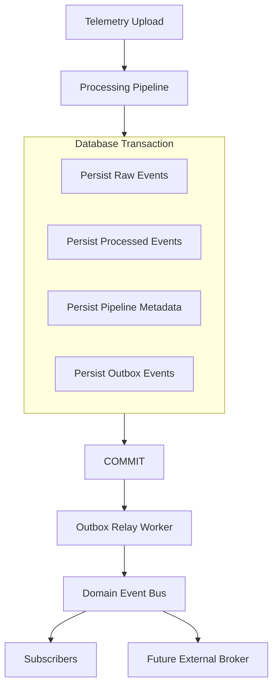
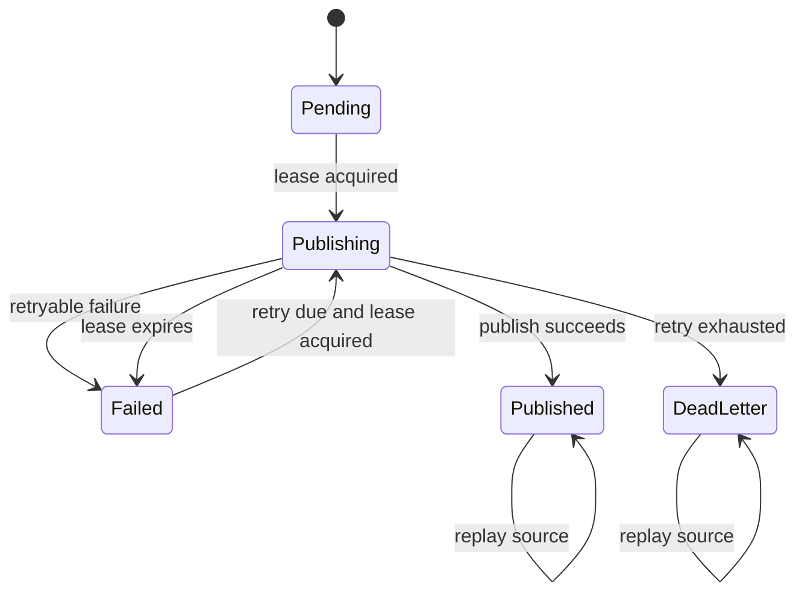
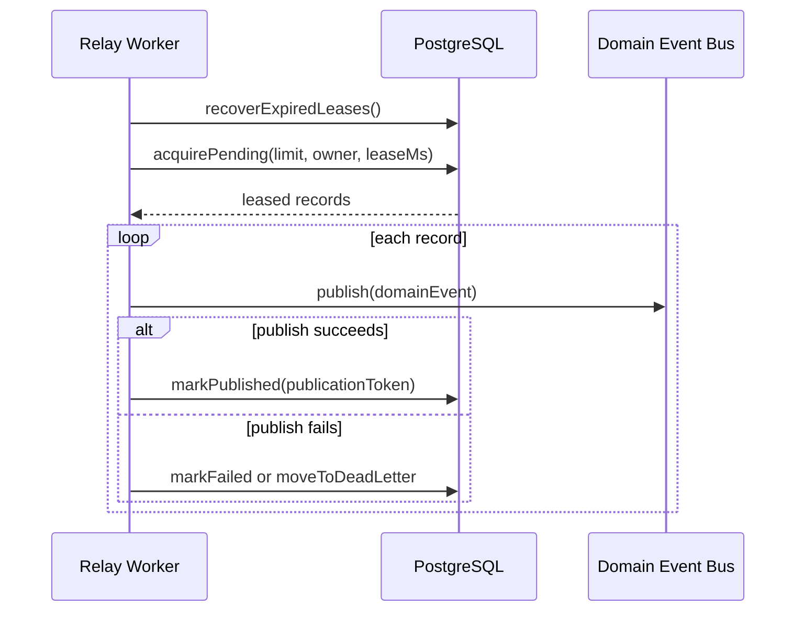

# Transactional Outbox

The Transactional Outbox guarantees that backend domain events are written atomically with the database changes that caused them. It replaces direct request-time publication with a durable relay model.

## Problem

Direct publication from an HTTP request can lose or invent events:

- If the process crashes after database commit but before publication, downstream subscribers never see the event.
- If the process publishes before commit and the transaction later rolls back, subscribers see a phantom event.
- If the relay crashes after publication but before marking success, recovery needs idempotent publication and subscriber protection.

The outbox solves this by persisting events inside the same transaction as the business data, then publishing them after commit through a relay worker.

## Architecture



No event is published before commit. If the transaction rolls back, the outbox row rolls back with the telemetry records.

## Outbox Event State Machine



States:

| State | Meaning |
| --- | --- |
| `pending` | Stored transactionally and waiting for relay. |
| `publishing` | Leased by one relay owner. |
| `published` | Successfully published to the Domain Event Bus. |
| `failed` | Retryable failure; eligible after `next_attempt_at`. |
| `dead_letter` | Retry attempts exhausted; available for administrative replay. |

## Relay Lifecycle



The relay uses `FOR UPDATE SKIP LOCKED` in PostgreSQL so future backend replicas can cooperate without processing the same outbox row at the same time.

## Ordering

The relay preserves ordering per aggregate. A pending, failed, or publishing earlier event blocks later events with the same `(aggregateType, aggregateId)`. Ordering uses a monotonic PostgreSQL `outbox_sequence`, not timestamps, because multiple rows in the same transaction can share the same `created_at` value.

Different aggregates may publish independently.

## Idempotency

The design uses several layers:

- `domain_event_outbox.event_id` is unique.
- Relay leases use `publication_token`.
- `markPublished`, `markFailed`, and `moveToDeadLetter` require the active publication token.
- Domain event persistence uses `ON CONFLICT (event_id) DO NOTHING`.
- Audit and dispatch metrics use unique event/subscriber markers.
- Future subscribers must treat `eventId` as an idempotency key.

If a relay crashes after publishing but before marking the row as published, recovery may attempt delivery again. Logical exactly-once behavior depends on subscriber idempotency by `eventId`, which is the standard distributed-systems trade-off for outbox relay delivery.

## Replay

Replay is implemented in the relay worker for selected published or dead-letter events.

Supported filters:

- Aggregate type.
- Aggregate id.
- Event type.
- Date range.
- Batch id.

Replay publishes through the same Domain Event Bus contract and records attempts in `domain_event_replay_log`.

## Failure Recovery

| Failure | Recovery |
| --- | --- |
| Crash during transaction | Transaction rolls back; no outbox row exists. |
| Crash after commit | Relay later finds `pending` rows. |
| Crash during publish | Lease expires; relay marks eligible for retry. |
| Crash before acknowledgement | Upload idempotency and telemetry event ids prevent duplicate telemetry rows. |
| Relay restart | Pending and failed rows remain durable. |
| Deployment restart | Relay resumes from PostgreSQL state. |
| Database restart | Relay retries after database connection recovery. |
| Duplicate relay workers | `FOR UPDATE SKIP LOCKED` and leases prevent duplicate ownership. |
| Retry exhaustion | Row moves to `dead_letter` with retry history and error details. |

## Operational Controls

Environment variables:

| Variable | Default | Purpose |
| --- | --- | --- |
| `OUTBOX_RELAY_ENABLED` | `true` | Starts relay in the backend process. |
| `OUTBOX_RELAY_BATCH_SIZE` | `100` | Maximum records leased per tick. |
| `OUTBOX_RELAY_LEASE_MS` | `30000` | Lease duration. |
| `OUTBOX_RELAY_POLL_INTERVAL_MS` | `1000` | Poll interval. |
| `OUTBOX_RELAY_MAX_ATTEMPTS` | `5` | Retry attempts before dead letter. |

## Runtime Verification

```powershell
cd backend
node scripts/verify-transactional-outbox.js
```

The harness verifies rollback safety, crash recovery, duplicate relay workers, lease expiration, retry exhaustion, dead-letter creation, replay, ordering, large backlog handling, mixed aggregates, and logical exactly-once publication markers.
