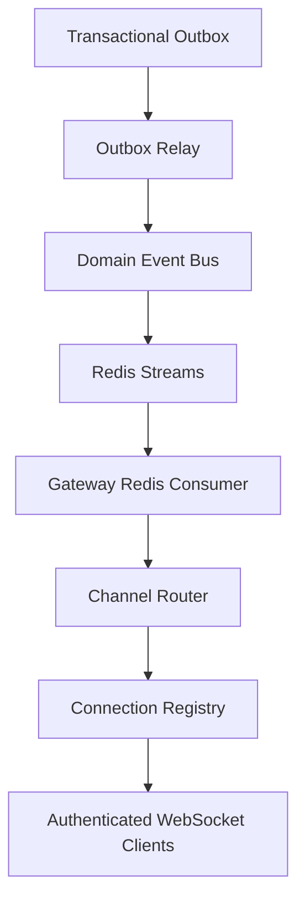

# WebSocket Gateway

The WebSocket Gateway is CPInsight's realtime distribution service. It consumes immutable Domain Events from Redis Streams and delivers authorized, serialized messages to authenticated WebSocket clients.

The gateway does not perform business logic. It does not query telemetry tables. It does not read the transactional outbox. Redis Streams are its only event input.

## Architecture



## Responsibilities

| Component | Responsibility |
| --- | --- |
| Gateway | WebSocket upgrade handling, connection lifecycle, shutdown. |
| Authenticator | Validates JWT access tokens and resolves users. |
| Registry | Tracks connections, users, subscriptions, and presence. |
| Channel Authorizer | Allows only authorized channel subscriptions. |
| Channel Router | Maps domain events to logical channels. |
| Redis Gateway Consumer | Consumes Redis Streams and passes domain events to the gateway. |
| Serializer | Converts domain events into versioned outbound messages. |

## Authentication

Connections authenticate during the WebSocket upgrade. Tokens may be provided as:

- `Authorization: Bearer <accessToken>`
- `/realtime?token=<accessToken>`

The gateway validates the JWT with the existing backend access-token verifier and loads the user from PostgreSQL. Client-supplied user ids are ignored.

Unauthorized or expired tokens are rejected during upgrade. Clients should refresh through the normal HTTP refresh-token flow and reconnect with a new access token.

## Channel Model

Supported channels:

| Channel | Authorization |
| --- | --- |
| `user:{userId}` | Only the authenticated user. |
| `telemetry:{userId}` | Only the authenticated user. |
| `analytics:{userId}` | Only the authenticated user. |
| `contest:{contestId}` | Any authenticated user in the current implementation. |
| `system` | Any authenticated user. |

Future team and organization channels can be added inside the channel authorizer without changing Redis consumers.

## Message Contract

Every outbound message is immutable and versioned:

```json
{
  "messageId": "uuid",
  "messageType": "EVENT",
  "eventVersion": 1,
  "occurredAt": "2026-07-23T12:00:00.000Z",
  "publishedAt": "2026-07-23T12:00:00.100Z",
  "payload": {},
  "metadata": {},
  "sequenceNumber": 42
}
```

## Backpressure

Each connection has a bounded outbound queue. If a client exceeds the configured queue limit, the gateway records a dropped message and disconnects that client. One slow client cannot block other clients.

## Presence

Presence is derived from active authenticated connections in memory:

- One user may have multiple connections.
- Multiple tabs are represented as independent connections.
- Presence is intentionally ephemeral and recomputable.
- No business state is stored in the gateway.

## Reconnect

Clients reconnect with a new or refreshed access token and may send a `RESUME` message containing the last sequence number they observed. The gateway acknowledges the resume request. Missed-event replay is intentionally a protocol hook; durable replay remains owned by Redis Streams and the outbox replay mechanisms.

## Scalability

The gateway is stateless aside from active sockets and subscriptions. Multiple replicas can run behind a load balancer. Redis Consumer Groups distribute stream entries across gateway replicas.

## Runtime Verification

```powershell
cd backend
node scripts/verify-realtime-gateway.js
```

The harness verifies 100+ simultaneous connections, unauthorized subscription rejection, multi-tab-style fan-out, reconnect acknowledgement, slow-client backpressure, heartbeat cleanup, Redis delivery, Redis acknowledgement, and graceful shutdown.
