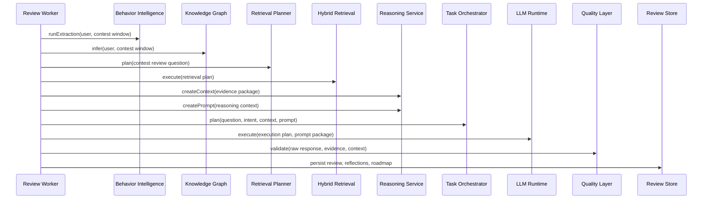

# Contest Review Job Processing

Contest review job processing is an ordered orchestration of existing CPInsight services. The worker does not implement behavior analytics, retrieval, reasoning, or validation logic itself.

## Processing Sequence

## Idempotency

`contest_review_jobs.live_session_id` is unique. Repeated stop requests update the existing queued job metadata instead of creating duplicate jobs. `contest_reviews.live_session_id` is also unique, so a completed review exists once per monitored contest session.

## Progress Events

The worker emits domain events through the transactional outbox:

| Event | Purpose |
| --- | --- |
| `review.job.claimed` | A worker acquired the job |
| `review.processing` | The worker started execution |
| `review.progress` | Stage progress changed |
| `review.completed` | Persistence completed |
| `review.failed` | Job exhausted retries |
| `review.retrying` | Job will be retried |
| `review.ready` | Clients can open the completed review |

Downstream clients receive these events through Redis Streams and the WebSocket gateway.

## API Surface

| Method | Endpoint | Purpose |
| --- | --- | --- |
| `GET` | `/api/reviews/jobs/:id` | Inspect one review job |
| `GET` | `/api/reviews/jobs` | List review jobs for the authenticated user |
| `GET` | `/api/reviews/latest` | Fetch the latest completed contest review |
| `GET` | `/api/reviews/status/:contestId` | Fetch review status for one contest |

All endpoints require bearer authentication.

## Related Documents

- [Contest Review Worker](review-worker.md)
- [Review Queue](review-queue.md)
- [Telemetry API](../api/telemetry-api.md)
