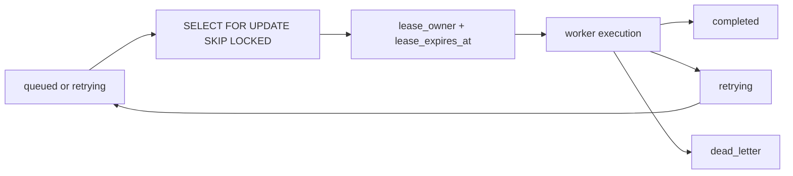

# Contest Review Queue

The review queue is stored in PostgreSQL so it survives API restarts, worker restarts, browser restarts, and deployment cycles.

## Tables

| Table | Purpose |
| --- | --- |
| `contest_review_jobs` | Durable queue and job state |
| `contest_review_execution_logs` | Stage transitions, timing, and diagnostic messages |
| `contest_reviews` | Final validated contest review |
| `contest_roadmap_updates` | Roadmap and recommendation tracking generated from a review |
| `contest_review_metrics` | Worker operational metrics |

## Atomic Claim

Workers claim jobs with `FOR UPDATE SKIP LOCKED`, ordered by `requested_at`. This allows multiple worker processes to run concurrently without two workers processing the same job.

## Lease Recovery

If a worker crashes while holding a lease, another worker can recover the job after `lease_expires_at`. Recovery returns the job to `retrying` and appends a lease recovery entry to `retry_history`.

## Ordering

Review jobs are independent per live session. Ordering is preserved within a single job by the worker state machine. Cross-job ordering is intentionally not guaranteed because different contests and users can process independently.

## Related Documents

- [Contest Review Worker](review-worker.md)
- [Dead Letter Queue](dead-letter-queue.md)
- [Transactional Outbox](../architecture/transactional-outbox.md)
