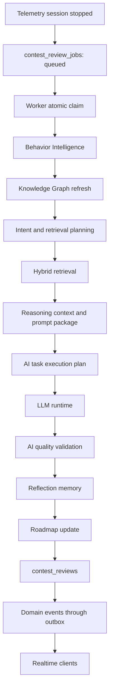

# Contest Review Worker

The Contest Review Worker is the asynchronous automation layer that turns a completed live monitoring session into a persisted contest review. It is deliberately outside the HTTP request path: `POST /api/telemetry/session/stop` only queues work, and the worker performs expensive processing later.

## Responsibilities

- Claim queued review jobs atomically.
- Execute existing behavior, knowledge, retrieval, reasoning, runtime, and validation services in order.
- Persist review output, reflections, roadmap updates, execution logs, and metrics.
- Publish review lifecycle domain events for Redis/WebSocket distribution.
- Retry transient failures and dead-letter permanently failing jobs.
- Resume safely after process restart or expired worker leases.

## Architecture



## Runtime Modes

The worker can run embedded in the API process when `REVIEW_WORKER_ENABLED=true`, or as a dedicated process:

```bash
cd backend
npm run worker:reviews
```

Production deployments should prefer a dedicated worker process so API request capacity and review processing capacity can scale independently.

## Configuration

| Environment variable | Default | Purpose |
| --- | ---: | --- |
| `REVIEW_WORKER_ENABLED` | `true` | Starts the embedded worker with the API process |
| `REVIEW_WORKER_CONCURRENCY` | `2` | Maximum concurrent jobs per worker process |
| `REVIEW_WORKER_POLL_INTERVAL_MS` | `2000` | Poll interval when no immediate work is available |
| `REVIEW_WORKER_RETRY_LIMIT` | `3` | Maximum attempts before dead-lettering |
| `REVIEW_WORKER_BATCH_SIZE` | `5` | Maximum jobs claimed per poll |
| `REVIEW_WORKER_LEASE_MS` | `120000` | Worker lease duration for claimed jobs |
| `REVIEW_WORKER_PROVIDER_TIMEOUT_MS` | `120000` | Provider timeout passed to review generation |
| `REVIEW_WORKER_QUEUE_CLEANUP_DAYS` | `30` | Retention horizon for future queue cleanup jobs |

## Job Stages

| Stage | Progress | Meaning |
| --- | ---: | --- |
| `queued` | 0% | Job was created after monitoring stopped |
| `claimed` | 5% | A worker acquired the job lease |
| `running` | 10% | Worker execution started |
| `behavior_processing` | 20% | Existing behavior extraction is running |
| `knowledge_graph_update` | 35% | Existing insight and graph refresh is running |
| `reasoning` | 55% | Retrieval, context, prompt, and task planning are running |
| `ai_review` | 75% | Existing LLM runtime is executing the review plan |
| `reflection` | 90% | Existing quality layer validates output and stores reflections |
| `roadmap_update` | 95% | Roadmap and recommendation tracking records are derived |
| `persist` | 98% | Final review records are being written |
| `completed` | 100% | Review is ready |

## Failure Behavior

Transient failures move the job to `retrying` with exponential backoff. Permanent failures move the job to `dead_letter` after the configured retry limit. The worker does not synthesize fallback reviews when the AI runtime fails; unavailable providers must surface as retryable or dead-lettered operational failures.

## Related Documents

- [Review Queue](review-queue.md)
- [Job Processing](job-processing.md)
- [Dead Letter Queue](dead-letter-queue.md)
- [Live Telemetry Session API](telemetry-session.md)
- [ADR-0029 Review Worker](../decisions/ADR-0029-review-worker.md)
