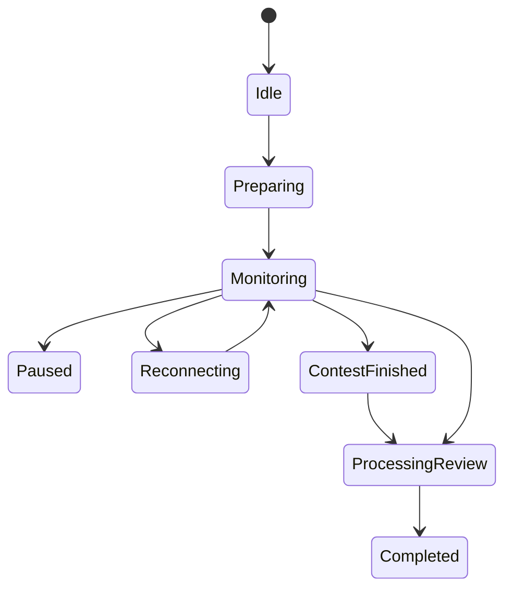

# Live Telemetry Session API

Live telemetry sessions are authenticated backend records that authorize extension-side contest monitoring.

## Endpoints

| Method | URL | Purpose |
| --- | --- | --- |
| `POST` | `/api/telemetry/session/start` | Create or resume a live monitoring session |
| `POST` | `/api/telemetry/events` | Accept live event batches and forward them to the existing telemetry pipeline |
| `POST` | `/api/telemetry/session/heartbeat` | Record connection and queue health |
| `POST` | `/api/telemetry/session/stop` | Stop monitoring and queue contest review processing |

All endpoints require bearer authentication.

## Session Token

`session/start` returns a random session token for new sessions. The backend stores only a SHA-256 hash. Subsequent event, heartbeat, and stop requests must include the token.

## State Machine

## Pipeline Reuse

`POST /api/telemetry/events` adapts live events into the existing `/api/telemetry/upload` batch contract and calls `uploadTelemetryBatch`. Live monitoring therefore reuses:

- ingestion validation;
- processing pipeline;
- transactional outbox;
- domain event bus;
- Redis distribution;
- WebSocket gateway routing.

## Review Automation

`POST /api/telemetry/session/stop` changes the live session to `processing_review` and creates or reuses one `contest_review_jobs` record for the live session. The [Contest Review Worker](review-worker.md) processes that job asynchronously and marks the live session `completed` after the final review is persisted.

## Persistence

Migration `017_live_contest_monitoring.sql` adds:

- `telemetry_live_sessions`
- `telemetry_live_heartbeat_logs`
- `telemetry_live_event_receipts`
- `contest_monitoring_metrics`
- `contest_review_jobs`

Migration `018_contest_review_worker.sql` extends review job persistence and adds review output, roadmap update, execution log, metric, and dead-letter tables.
