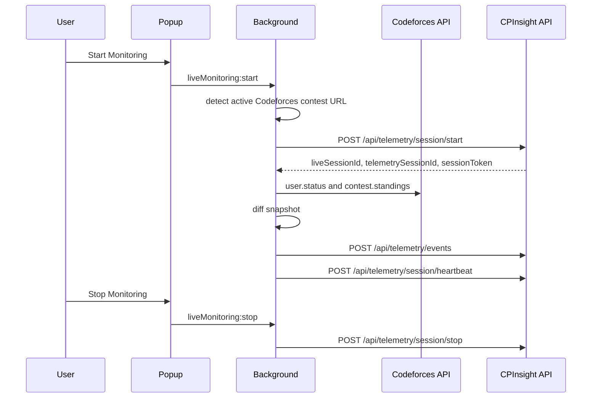

# Extension Live Monitoring

The extension live monitoring layer lets an authenticated user start a Codeforces contest monitoring session from the browser extension popup.

## Flow

## Supported Platform

Implemented:

- Codeforces contest and gym URLs.

Designed extension points:

- CodeChef collector can add a platform detector and API poller.
- LeetCode Contest can add a detector and official/source-approved polling adapter.

## Popup UI

The popup displays:

- connection state;
- contest detection status;
- contest name;
- elapsed duration;
- monitoring status;
- events sent;
- queue depth;
- connection health;
- Codeforces handle input;
- Start Monitoring, Stop Monitoring, and Reconnect buttons.

## Event Collection Boundary

The live SDK collects only contest telemetry:

- session lifecycle;
- problem and submission metadata;
- verdict transitions;
- rank changes;
- heartbeat and connection status.

It does not collect keyboard contents, clipboard, passwords, cookies, private messages, full page text, or unrelated browsing history.

## Official API Usage

Codeforces polling uses:

- `user.status`
- `contest.standings`

Verdicts are not scraped from HTML when the official API is available.

## Offline Support

Events are written to `chrome.storage.local` under `liveMonitoring.queue`. Upload retries preserve ordering by retaining unacknowledged events and removing only acknowledged event IDs.
