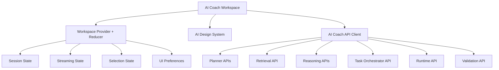

# AI Coach Workspace

The AI Coach Workspace is CPInsight's flagship AI product surface. It consumes existing backend AI APIs and renders validated coach responses through the [AI Design System](ai-design-system.md).

The workspace is not a chatbot wrapper. It is a three-panel evidence workspace for understanding contest history, behavioral patterns, recommendations, reflections, and study direction.

## Architecture



## Layout

The workspace uses a responsive three-panel layout:

- Left sidebar: session creation, session history, contest reviews, study plans, reflection timeline, saved reports, search, filters, settings.
- Center panel: conversation and generated AI surfaces.
- Right sidebar: persistent contextual insights including rating, goals, behavior summary, reflections, topics, and daily recommendations.

## Response Contract

Every completed coach message is rendered as structured sections:

- summary
- observations
- evidence
- reasoning
- confidence
- recommendations
- action items
- references

The workspace uses `CoachResponse`, `EvidenceExplorer`, `ReasoningPanel`, `QualityIndicator`, `RecommendationList`, and `ActionPlan` from the design system rather than rendering one long paragraph.

## API Boundary

The workspace calls existing internal AI endpoints through `createAiCoachApiClient`:

1. `POST /api/ai/planner/classify`
2. `POST /api/ai/planner/plan`
3. `POST /api/ai/retrieval/execute`
4. `POST /api/ai/reasoning/context`
5. `POST /api/ai/reasoning/prompt`
6. `POST /api/ai/tasks/plan`
7. `POST /api/ai/runtime/execute`
8. `POST /api/ai/validate`
9. `POST /api/ai/feedback`

The frontend does not classify intents, retrieve evidence, reason over evidence, select tasks, invoke models directly, or validate grounding.

## Page

The workspace page is `pages/ai-coach.html`. It mounts `src/apps/ai-coach/main.jsx` for Vite-based development and bundled production deployment.

Development:

```powershell
npm run dev:ai-coach
```

Production build:

```powershell
npm run build:frontend
```

`frontend.Dockerfile` runs this build and copies the Vite output into the Nginx image.

## Verification

Run:

```powershell
npm run verify:ai-coach-workspace
```
