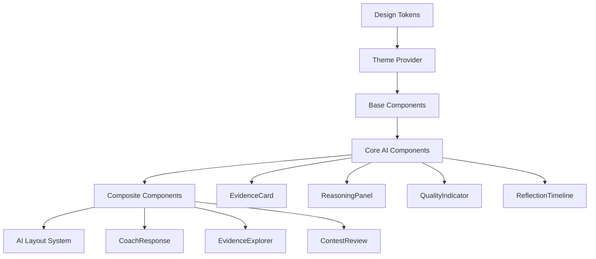

# AI Design System

The CPInsight AI Design System is a presentational React module for AI-facing interfaces. It provides the visual language for coach responses, contest reviews, evidence exploration, study plans, reflection timelines, behavior analytics, roadmaps, mentor mode, and future AI features.

It does not call backend APIs, execute retrieval, validate AI responses, perform task routing, or contain business logic. Backend AI architecture remains documented under [Response Validation](../architecture/response-validation.md), [Reasoning Context Engine](../architecture/reasoning-context-engine.md), and [LLM Runtime](../architecture/llm-runtime.md).

## Principles

- Evidence first: evidence and citations must be visible before claims feel final.
- Explainability: reasoning chains, confidence, contradictions, and missing evidence have dedicated UI surfaces.
- Transparency: quality and grounding status are first-class visual states.
- Progressive disclosure: dense evidence is expandable rather than hidden or always expanded.
- Low cognitive load: cards, timelines, and panels use consistent hierarchy.
- Accessibility: components support keyboard focus, ARIA labels, high contrast, and reduced motion.
- Dark-first design: dark mode is the default, with light and high-contrast themes supported by semantic tokens.

## Module Layout

```text
src/components/ai/
  animations/
  base/
  cards/
  charts/
  feedback/
  hooks/
  layout/
  providers/
  reasoning/
  stories/
  theme/
  timeline/
  tokens/
  index.js
```

## Component Hierarchy



## Presentational Boundary

Design-system components receive props and emit UI callbacks. They do not:

- call `fetch`;
- import backend services;
- read local storage;
- perform AI reasoning;
- perform retrieval;
- validate model output;
- mutate domain state.

Applications compose these components with service modules outside the design system.

## Verification

Run:

```powershell
npm run verify:ai-design-system
```

The verifier checks required files, token groups, accessibility affordances, animation classes, Storybook story coverage, and the presentational boundary.
