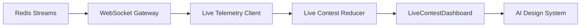

# Live Contest Dashboard

The Live Contest Dashboard consumes existing WebSocket events from the realtime gateway and displays deterministic live contest status.

## Architecture

## Channels

The dashboard subscribes to:

- `telemetry:{userId}`
- `contest:{contestId}`

These channels are authorized by the existing WebSocket Gateway channel authorizer.

## Displayed Metrics

- solved count;
- attempt count;
- rank;
- penalty;
- submissions;
- verdict distribution;
- behavior signals;
- confidence;
- timeline;
- contest duration;
- connection status.

## Boundaries

The dashboard does not read the outbox, query telemetry tables directly, generate AI output, or perform behavior inference. It renders domain events distributed through the existing realtime architecture.
