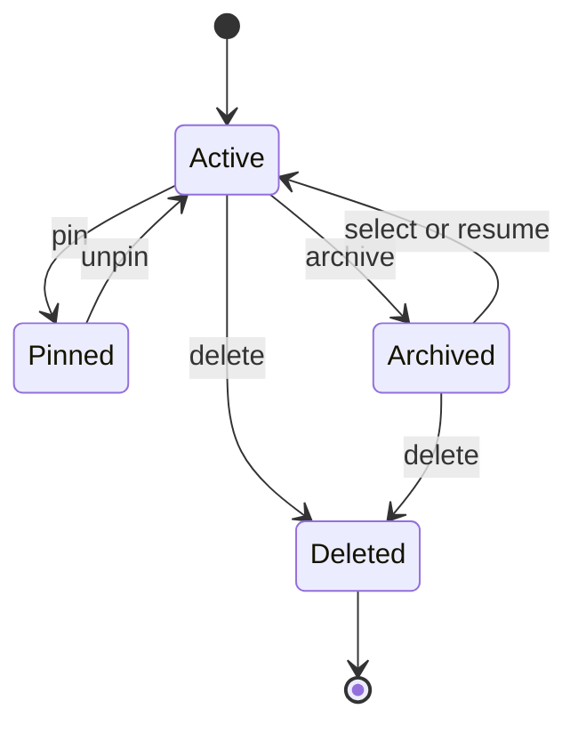
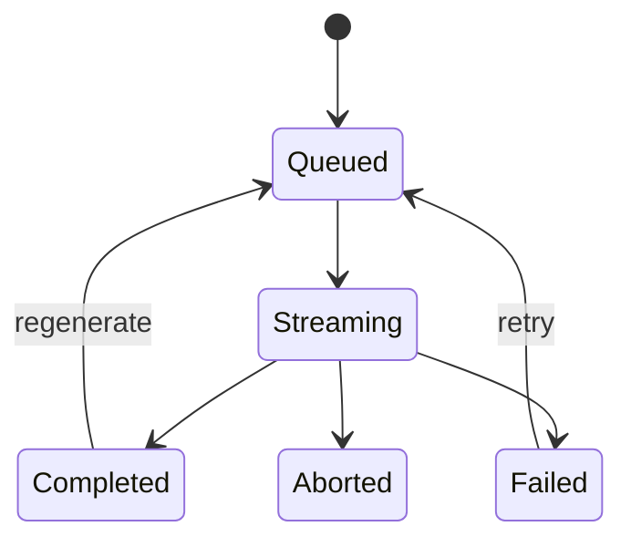

# AI Coach Session Lifecycle

The AI Coach session model is UI state managed by `AiCoachWorkspaceProvider` and `aiCoachReducer`. Backend AI execution remains stateless from the workspace perspective; durable server-side conversation persistence is future work.

## Supported Operations

| Operation | Reducer action |
| --- | --- |
| Create session | `sessions/created` |
| Select or resume session | `sessions/selected` |
| Rename session | `sessions/renamed` |
| Archive session | `sessions/archived` |
| Delete session | `sessions/deleted` |
| Pin session | `sessions/pinned` |
| Search sessions | `workspace/searchChanged` |
| Filter sessions | `workspace/filterChanged` |

## Lifecycle

## Message Lifecycle

## Persistence Boundary

Current session state is local to the React workspace. Server-side session history, saved reports, and cross-device continuation should be introduced through backend APIs before being treated as durable product data.
