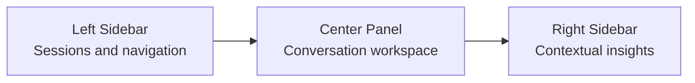

# AI Coach Workspace Layout

The workspace layout lives in `src/features/ai-coach/components/AiCoachWorkspace.jsx` and `src/features/ai-coach/styles/ai-coach-workspace.css`.

## Desktop



Desktop grid:

```css
grid-template-columns: 288px minmax(0, 1fr) 340px;
```

## Tablet

The right sidebar collapses first so the conversation remains primary.

```css
@media (max-width: 1180px)
```

## Mobile

The left sidebar collapses and the center panel becomes the primary surface.

```css
@media (max-width: 780px)
```

## Panel Controls

Keyboard shortcuts support:

- `Ctrl/Cmd + K`: focus search.
- `Ctrl/Cmd + N`: new session.
- `Ctrl/Cmd + [`: toggle left panel.
- `Ctrl/Cmd + ]`: toggle right panel.
- `Escape`: abort active generation.

These shortcuts are implemented in `useAiCoachKeyboardShortcuts`.

## Deployment

The workspace is mounted from `pages/ai-coach.html` and bundled by Vite. The production frontend image runs `npm run build:frontend` before serving static files through Nginx.
