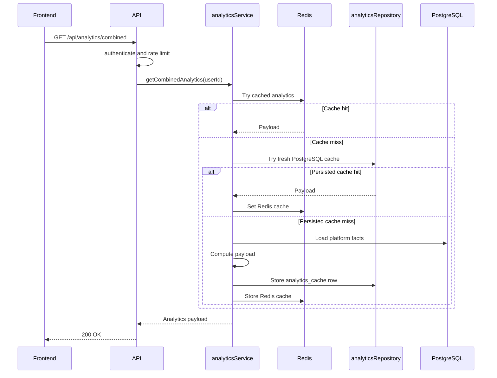

# Analytics Refresh Sequence

```mermaid
sequenceDiagram
  participant Frontend
  participant API
  participant Analytics as analyticsService
  participant Redis
  participant Cache as analyticsRepository
  participant DB as PostgreSQL

  Frontend->>API: GET /api/analytics/combined
  API->>API: authenticate and rate limit
  API->>Analytics: getCombinedAnalytics(userId)
  Analytics->>Redis: Try cached analytics
  alt Cache hit
    Redis-->>Analytics: Payload
  else Cache miss
    Analytics->>Cache: Try fresh PostgreSQL cache
    alt Persisted cache hit
      Cache-->>Analytics: Payload
      Analytics->>Redis: Set Redis cache
    else Persisted cache miss
      Analytics->>DB: Load platform facts
      Analytics->>Analytics: Compute payload
      Analytics->>Cache: Store analytics_cache row
      Analytics->>Redis: Store Redis cache
    end
  end
  Analytics-->>API: Analytics payload
  API-->>Frontend: 200 OK
```

LeetCode analytics use more conservative caching because extension uploads can replace the local fact set.
