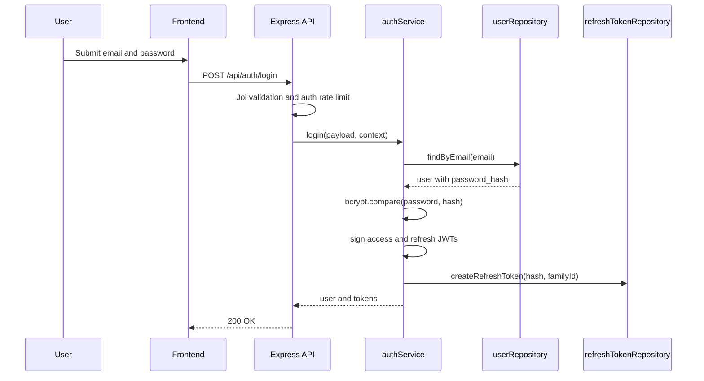

# User Login Sequence

This sequence documents implemented user login behavior.

```mermaid
sequenceDiagram
  participant User
  participant Frontend
  participant API as Express API
  participant Auth as authService
  participant Users as userRepository
  participant Tokens as refreshTokenRepository

  User->>Frontend: Submit email and password
  Frontend->>API: POST /api/auth/login
  API->>API: Joi validation and auth rate limit
  API->>Auth: login(payload, context)
  Auth->>Users: findByEmail(email)
  Users-->>Auth: user with password_hash
  Auth->>Auth: bcrypt.compare(password, hash)
  Auth->>Auth: sign access and refresh JWTs
  Auth->>Tokens: createRefreshToken(hash, familyId)
  Auth-->>API: user and tokens
  API-->>Frontend: 200 OK
```

The refresh token returned to the client is not stored directly in PostgreSQL. Only its SHA-256 hash is stored.
