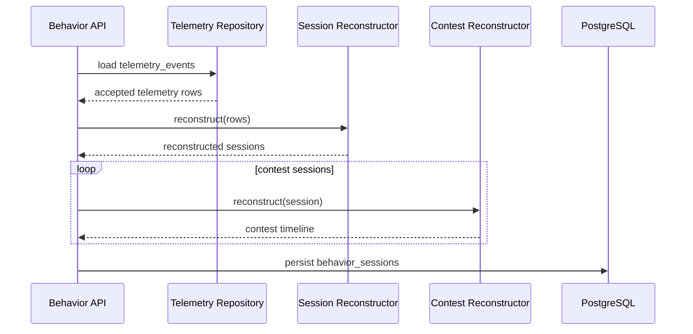

# Behavior Reconstruction Sequence

```mermaid
sequenceDiagram
  participant API as Behavior API
  participant Repo as Telemetry Repository
  participant Session as Session Reconstructor
  participant Contest as Contest Reconstructor
  participant DB as PostgreSQL

  API->>Repo: load telemetry_events
  Repo-->>API: accepted telemetry rows
  API->>Session: reconstruct(rows)
  Session-->>API: reconstructed sessions
  loop contest sessions
    API->>Contest: reconstruct(session)
    Contest-->>API: contest timeline
  end
  API->>DB: persist behavior_sessions
```
