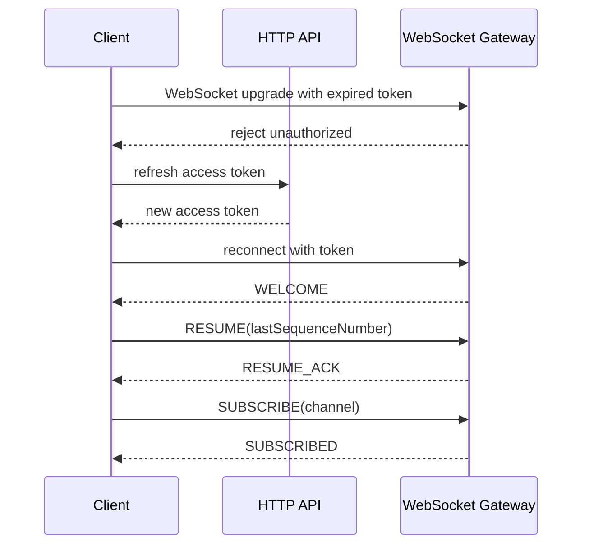

# Client Reconnect

```mermaid
sequenceDiagram
  participant C as Client
  participant API as HTTP API
  participant G as WebSocket Gateway

  C->>G: WebSocket upgrade with expired token
  G-->>C: reject unauthorized
  C->>API: refresh access token
  API-->>C: new access token
  C->>G: reconnect with token
  G-->>C: WELCOME
  C->>G: RESUME(lastSequenceNumber)
  G-->>C: RESUME_ACK
  C->>G: SUBSCRIBE(channel)
  G-->>C: SUBSCRIBED
```

The gateway never refreshes tokens itself. Refresh remains an HTTP authentication responsibility.
