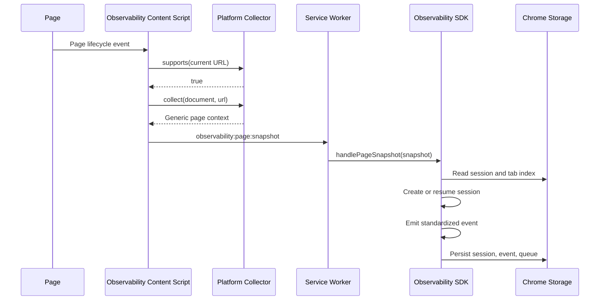

# Contest Session Sequence

This sequence documents implemented Codeforces and CodeChef contest-session detection through the Observability SDK.

Only one active session is created per collector and contest id. Additional tabs attach to the same session.
