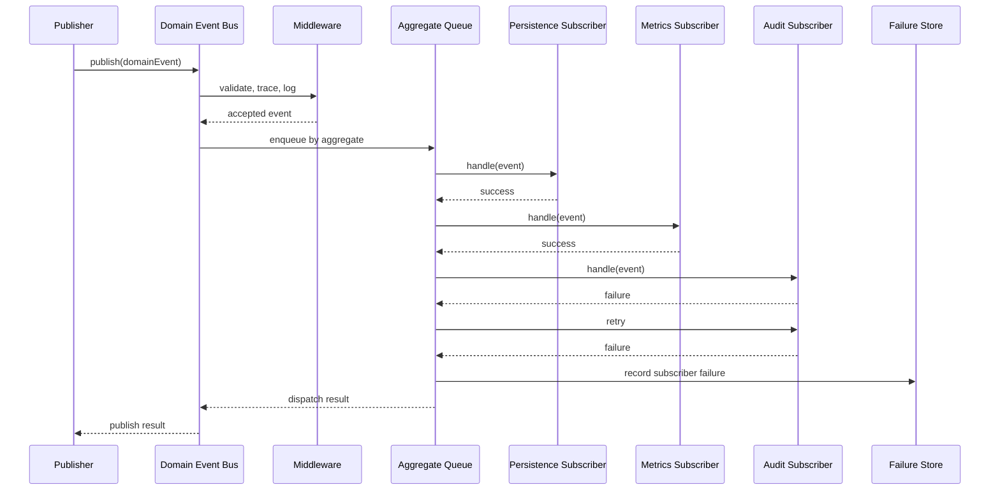

# Domain Event Dispatch

This sequence describes how a processed backend fact moves through the generic Domain Event Bus.

Guarantees:

- Events for the same aggregate are dispatched in publication order.
- Subscriber failures are isolated.
- Middleware runs before subscriber dispatch.
- Duplicate subscriber ids are rejected.
- Publishers do not know subscriber implementations.
