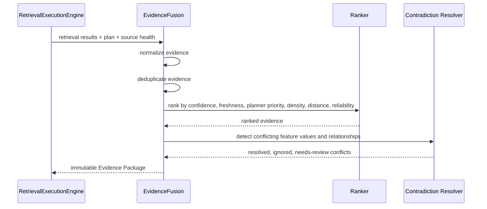

# Evidence Fusion Sequence

```mermaid
sequenceDiagram
  participant Engine as RetrievalExecutionEngine
  participant Fusion as EvidenceFusion
  participant Ranker as Ranker
  participant Resolver as Contradiction Resolver

  Engine->>Fusion: retrieval results + plan + source health
  Fusion->>Fusion: normalize evidence
  Fusion->>Fusion: deduplicate evidence
  Fusion->>Ranker: rank by confidence, freshness, planner priority, density, distance, reliability
  Ranker-->>Fusion: ranked evidence
  Fusion->>Resolver: detect conflicting feature values and relationships
  Resolver-->>Fusion: resolved, ignored, needs-review conflicts
  Fusion-->>Engine: immutable Evidence Package
```

The fusion pipeline never builds LLM prompt context. It produces structured evidence only.

