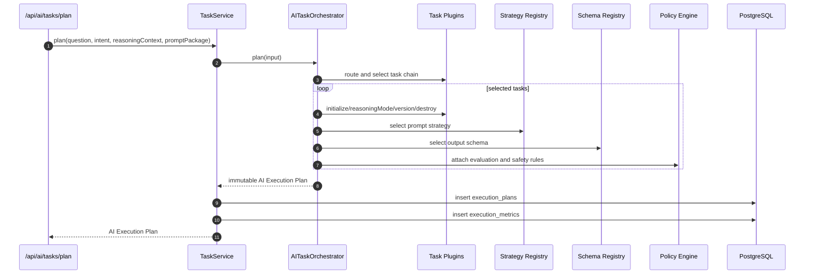

# Execution Plan Generation

```mermaid
sequenceDiagram
  autonumber
  participant API as /api/ai/tasks/plan
  participant Service as TaskService
  participant Orchestrator as AITaskOrchestrator
  participant Tasks as Task Plugins
  participant Strategies as Strategy Registry
  participant Schemas as Schema Registry
  participant Policies as Policy Engine
  participant DB as PostgreSQL

  API->>Service: plan(question, intent, reasoningContext, promptPackage)
  Service->>Orchestrator: plan(input)
  Orchestrator->>Tasks: route and select task chain
  loop selected tasks
    Orchestrator->>Tasks: initialize/reasoningMode/version/destroy
    Orchestrator->>Strategies: select prompt strategy
    Orchestrator->>Schemas: select output schema
    Orchestrator->>Policies: attach evaluation and safety rules
  end
  Orchestrator-->>Service: immutable AI Execution Plan
  Service->>DB: insert execution_plans
  Service->>DB: insert execution_metrics
  Service-->>API: AI Execution Plan
```

The execution plan is ready for a future LLM runtime but is not executed in this phase.

